.. _rst_electronics_bipolar_bipolar:

Изучение свойств биполярного транзистора
========================================

.. note::
    Данная статья задумывалась как лабораторная работа к курсу `Электроника для начинающих, Д.Забарило`_

    Уроки:

    - 20.1 Транзисторы
    - 20.2 Принцип работы биполярного транзистора
    - 20.3 Расчет параметров транзисторного ключа на биполярном транзисторе
    - 20.4 Исследование работы транзисторного ключа
    - 20.5 Транзистор Дарлингтона

    Бесплатные материалы по теме:

    #. `Транзисторный ключ от А до Я. Практика и теория. Полевые MOSFET и биполярные транзисторы`_
    #. `Транзистор полевой, биполярный, MOSFET, IGBT`_
    #. `Как правильно соединять транзисторы. На реальных примерах`_
    #. `Transistor amplifier Part 1`_
    #. `Transistor amplifier Part 2`_
    #. `Усилители звука - это просто! Усилители звука с нуля для начинающих`_

Загрузки:

- :download:`Интерактивный график в формате html для Rb=680 Ом <docs/bipolar_rb_680.html>`
- :download:`Измерения в формате csv для Rb=680 Ом <docs/bipolar_rb_680.csv>`
- :download:`Интерактивный график в формате html для Rb=6800 Ом <docs/bipolar_rb_6800.html>`
- :download:`Измерения в формате csv для Rb=6800 Ом <docs/bipolar_rb_6800.csv>`

Типы транзисторов по структуре:

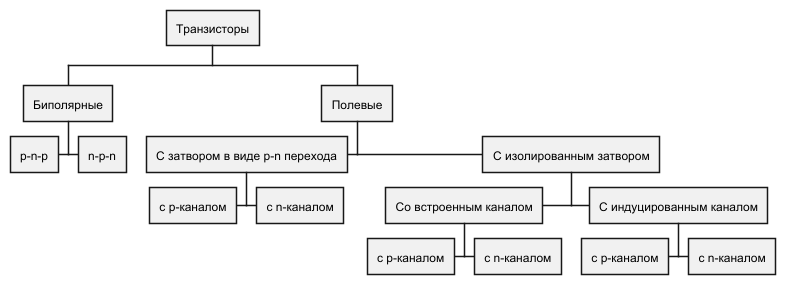

| В данной работе изучается **Биполярный транзистор**.

Задачи
------

#. Изучить свойства биполярного транзистора в режиме ключа.
#. Построить графики зависимости тока и напряжения на участке коллектор-эмиттер
   от тока и напряжения на участке база-эмиттер.
#. Экспериментально проверить расчетное значение тока и напряжения открытия транзистора на участке база-эмиттер.

Введение
--------

Обозначение биполярного транзистор **n-p-n** структуры на принципиальных схемах:

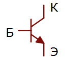

- Коллектор / Drain (-)
- База / Gate (+) (управляющее напряжение)
- Эмиттер / Source (+)

Сема подключения транзистора в качестве ключа:

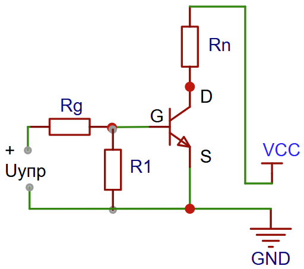

- **Rg** - сопротивление, ограничивающее ток "база-эмиттер" (G-S).

- **R2** - притягивающий резистор (R2 >> Rg). Он подает (-) на переход "база-эмиттер" (G-S),
  чтобы транзистор не открывался от помех, наведенных на висящий провод выключателя.
  Для биполярных транзисторов не так актуально, как для полевых транзисторов,
  т.к. транзистор открывается при наличии тока.

Переход **"коллектор-эмиттер"** изначально имеет большое сопротивление.
При подаче напряжения на переход **"база-эмиттер"**, через этот переход начинает протекать ток
и сопротивление на переходе **"коллектор-эмиттер"** снижается.

Для открытия перехода "коллектор-эмиттер" на переход "база-эмиттер"
нужно подать напряжение **0.7 В** (для кремниевых транзисторов).
До насыщения базы электронами ток коллектор-эмиттер изменяется линейно,
также как ток и напряжение на переходе "база-эмиттер".
При достижении **тока** насыщения на база-эмиттерном переходе,
сопротивление и, соответственно, ток на переходе "коллектор-эмиттер" перестает изменяться линейно.

.. note::
    Недостатком использования биполярных транзисторов в качестве ключей является большая потеря мощности на транзисторе
    за счет большого тока "база-эмиттер".

.. important::
    Для насыщения перехода "база-эмиттер" нужно определенное значение **тока!**, а не напряжения,
    как в случае с полевым транзистором!

Описание опыта
--------------

Сема подключения транзистора приведена на рисунке ниже.

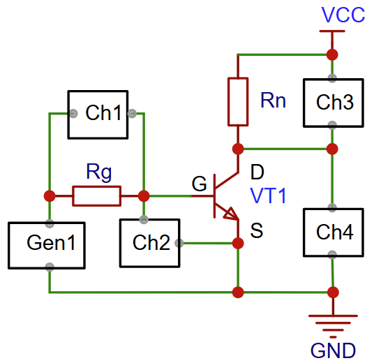

- **VCC** - Uкэ (в закрытом состоянии) = 8.5В
- **VT1** - 2N5551
- **U(Gen1)** - 0В - +5В (треугольник) подается от генератора Gen1 с частотой 500 Гц
- **Ids** = 75 мА (произвольное значение, но не более Iкэ макс)
- **Ugs** = 0.7 В (теоретическое значение для кремниевых транзисторов)
- **hFE** - 290 (определено с помощью измерительного прибора). :math:`hFE=Iкэ / Iбэ`

Расчетные значения:

- **Rg** - 680 Ом (889.33 Ом) - транзистор гарантированно открыт работает в режиме ключа.
- **Rg** - 6800 Ом (8893.33 Ом) - транзистор работает на границе режима усиления и ключа.
- **Rn** - 100 Ом (113.33 Ом)

Характеристики транзистора 2N5551 (транзистор n-p-n структуры в корпусе TO-92)
    - **Iкэ макс** = 600 мА
    - **Uкэ макс** = 160 В
    - **hFE** = 80-250 (коэффициент усиления по току :math:`hFE=Iкэ / Iбэ`).

Расчет сопротивления базы (Rg)
    .. math::
        Rg = Ug / Ig

Для расчетов будем использовать **U(Gen1) = 3В**, чтобы наблюдать процессы в цепи при превышении расчетных значений.

Первый вариант расчета сопротивления Rb для работы в режиме ключа,
    Для расчета сопротивления базы для схемы, работающей в режиме ключа
    можно взять коэффициент усиления по току (hFE) деленный на десять,
    чтобы транзистор был гарантированно открыт.

.. math::
    hFE(расчетное) = hFE / 10

Рассчитаем сопротивление базы (Rg):

.. math::
    Rg = Ug / Ig = (U(Gen1) - Ugs) / (Ids / hFE(расчетное))\\
    = (3 - 0.7) / (0.075 / (290 / 10)) = 889.33 Ом

Ближайшее стандартное значение **Rg = 680 Ом**

Второй вариант расчета сопротивления Rb для работы транзистора на границе режима усиления и ключа
    Для этого случая возьмем коэффициент усиления по току (hFE) как он есть.

.. math::
    Rg = Ug / Ig = (U(Gen1) - Ugs) / (Ids / hFE(расчетное))\\
    = (3 - 0.7) / (0.075 / 290) = 8893.33 Ом

Возьмем ближайшее стандартное значение **Rg = 6800 Ом**

Расчет значения Rn
    .. math::
        Rn = Un / Ids

Для расчетов примем падение напряжения на переходе "коллектор-эмиттер" равным нулю (Uds = 0 В).

.. math::
    Rn = Un / Ids = (VCC - Uds) / Ids = (8.5 - 0) / 0.075 = 113.33 Ом

Возьмем ближайшее значение **Rn = 100 Ом**

Лабораторная работа
-------------------

Сопротивление базы 680 Ом (режим ключа)
^^^^^^^^^^^^^^^^^^^^^^^^^^^^^^^^^^^^^^^

С генератора (Gen1) подаются прямоугольные импульсы.

- Частота: 500 Гц
- Амплитуда: 0 В - 5 В

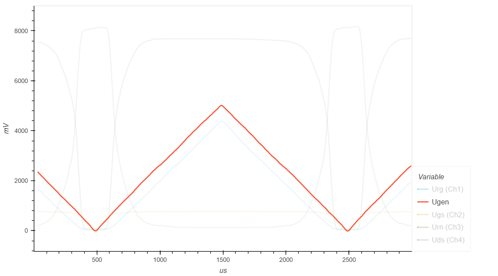

   Сигнал генератора Gen1

Ниже представлен график падения напряжения на сопротивлении базы Rg (осц. Ch1) и на переходе "база-эмиттер" (осц. Ch2).
До достижения уровня напряжения порядка 0.7 В на переходе "база-эмиттер", переход закрыт, ток через
него не идет и на сопротивлении базы (Rg) нет падения напряжения.

При достижении напряжения 0.7 В , переход "база-эмиттер" открывается и через него начинает протекать ток.
Причем, падение напряжения на сопротивлении базы (Rg) и, соответственно, ток увеличиваются линейно
в зависимости от поданного напряжения. А на переходе "база-эмиттер" падение напряжения не изменяется.
Т.е. сопротивление на переходе "база-эмиттер" изменяется в зависимости от приложенного напряжения.

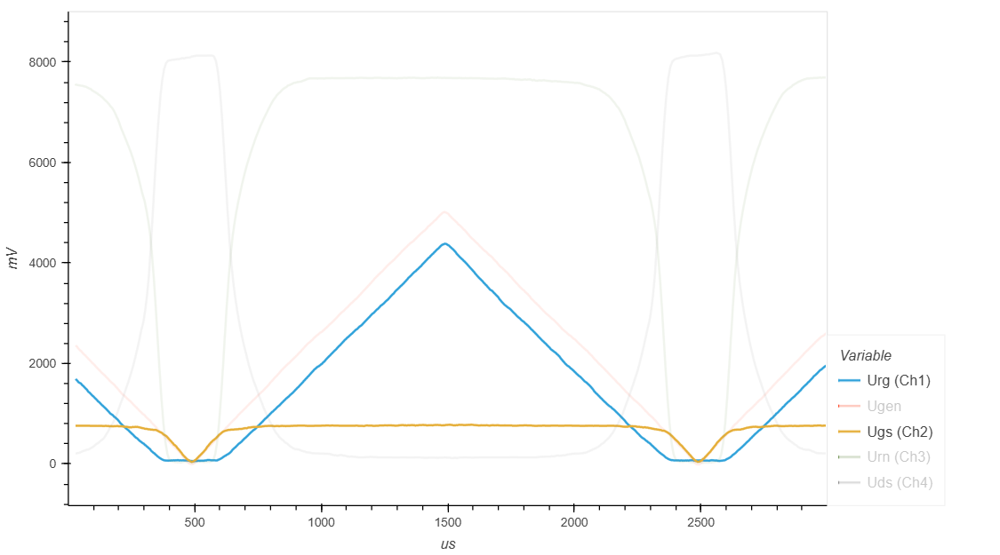

   Падение напряжения на Rg (осц. Ch1) и на переходе "база-эмиттер" (осц. Ch2)

На графике ниже показано изменение сопротивления перехода "база-эмиттер"
в зависимости от протекающего через переход тока, на интервале времени, когда переход открыт и падение напряжения
на нем неизменное (0.7 В).

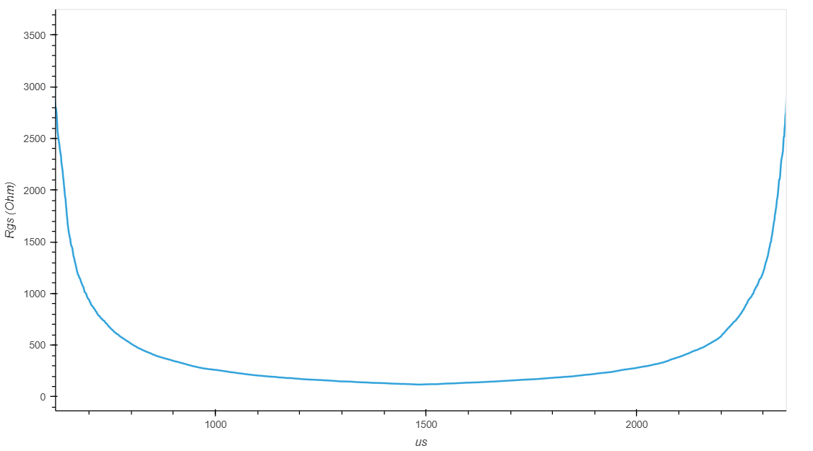

   Зависимость сопротивления перехода "база-эмиттер" от протекающего тока

Минимальное значение сопротивления перехода "база-эмиттер" составило 119 Ом, максимальное 5712 Ом.

Падение напряжения на переходе "коллектор-эмиттер" изменяется как показано на рисунке ниже.
Когда переход "база-эмиттер" закрыт, переход "коллектор-эмиттер" имеет большое сопротивление
и все напряжение падает на нем. Падение напряжения на сопротивлении нагрузки близко к нулю.
Когда переход "база-эмиттер" открывается, сопротивление перехода "коллектор-эмиттер" снижается
и через переход начинает протекать ток. Когда переход "база-эмиттер" полностью открыт, он имеет
очень низкое сопротивление и на нем практически нет падения напряжения.
Все напряжение падает на сопротивлении нагрузки (Rn).

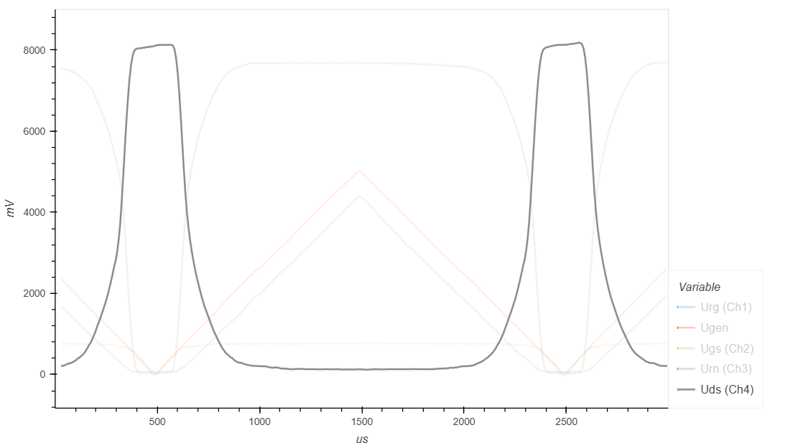

   Падение напряжения на переходе "коллектор-эмиттер" (осц. Ch3)

При этом, на сопротивлении нагрузки (Rn), наблюдается обратная картина.
Когда переход "база-эмиттер" закрыт, падения напряжения на сопротивлении нагрузки (Rn) нет,
поскольку сопротивление перехода "коллектор-эмиттер" значительно выше сопротивления нагрузки.
Когда переход "база-эмиттер" открыт, все напряжение падает на сопротивлении нагрузки (Rn),
поскольку сопротивление перехода "коллектор-эмиттер" имеет минимальное значение.

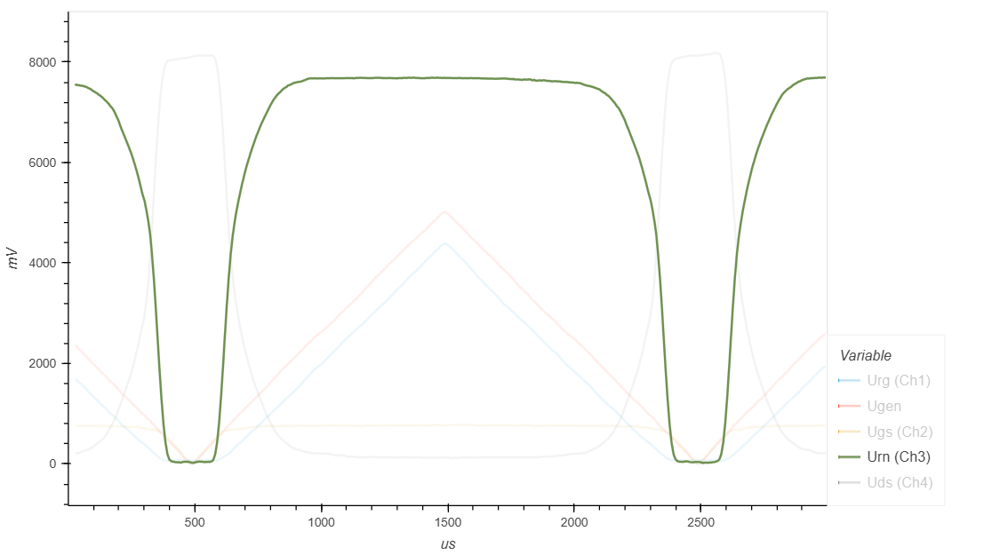

   Падение напряжения на сопротивлении нагрузки Rn (осц. Ch4)

Ниже представлен график изменения сопротивления перехода "коллектор-эмиттер"
на интервале времени, когда переход "база-эмиттер" открыт.

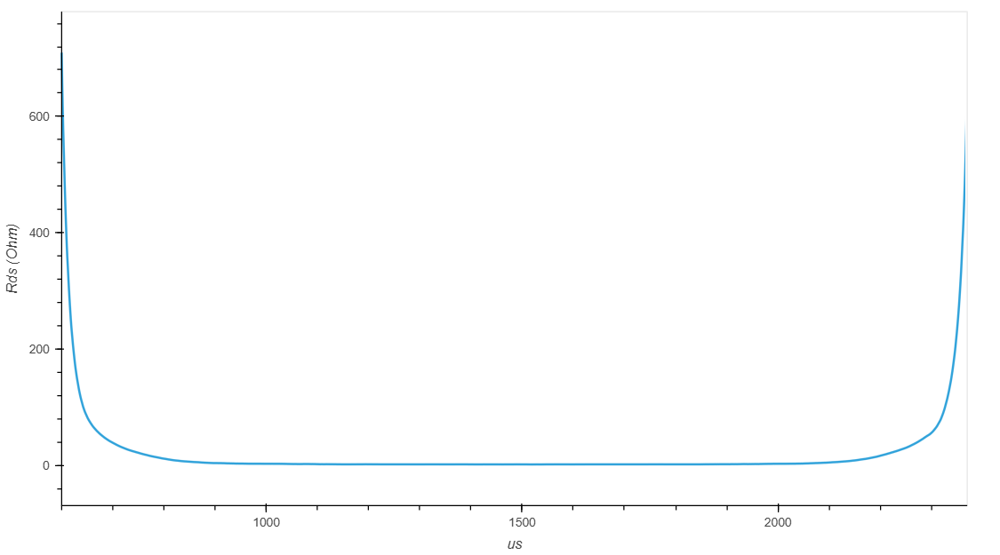

   Сопротивление перехода "коллектор-эмиттер"

Минимальное значение сопротивления перехода "коллектор-эмиттер" составило 1.5 Ом, максимальное 43625 Ом.

График изменения коэффициента усиления на интервале времени, когда переход "база-эмиттер" открыт
представлен на рисунке ниже.

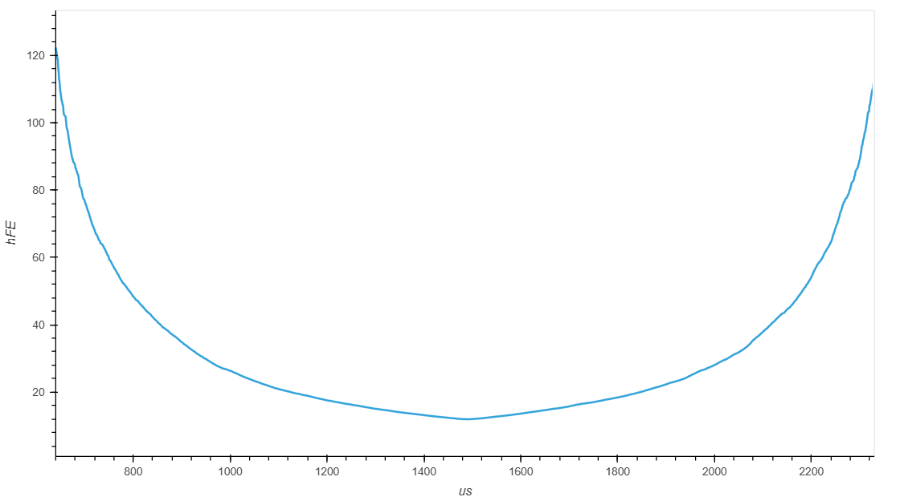

   Изменение коэффициента усиления (hFE)

Минимальное значение коэффициента усиления (hFE) составило 11.9, максимальное 122.3.

- :download:`Интерактивный график в формате html <docs/bipolar_rb_680.html>`
- :download:`Измерения в формате csv <docs/bipolar_rb_680.csv>`

Сопротивление базы 6800 Ом (режим усиления)
^^^^^^^^^^^^^^^^^^^^^^^^^^^^^^^^^^^^^^^^^^^

С генератора (Gen1) подаются прямоугольные импульсы.

- Частота: 500 Гц
- Амплитуда: 0 В - 5 В

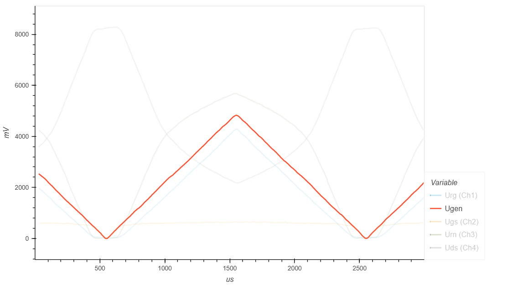

   Сигнал генератора Gen1

Ниже представлен график падения напряжения на сопротивлении базы Rg (осц. Ch1) и на переходе "база-эмиттер" (осц. Ch2).
До достижения уровня напряжения порядка 0.7 В на переходе "база-эмиттер", переход закрыт, ток через
него не идет и на сопротивлении базы (Rg) нет падения напряжения.

При достижении напряжения 0.7 В , переход "база-эмиттер" открывается и через него начинает протекать ток.
Причем, падение напряжения на сопротивлении базы (Rg) и, соответственно, ток увеличиваются линейно
в зависимости от поданного напряжения. А на переходе "база-эмиттер" падение напряжения не изменяется.
Т.е. сопротивление на переходе "база-эмиттер" изменяется в зависимости от приложенного напряжения.

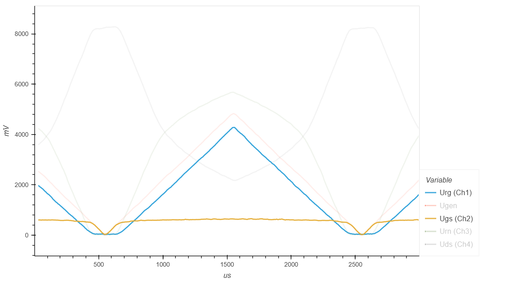

   Падение напряжения на Rg (осц. Ch1) и на переходе "база-эмиттер" (осц. Ch2)

На графике ниже показано изменение сопротивления перехода "база-эмиттер"
в зависимости от протекающего через переход тока, на интервале времени, когда переход открыт и падение напряжения
на нем неизменное (0.7 В).

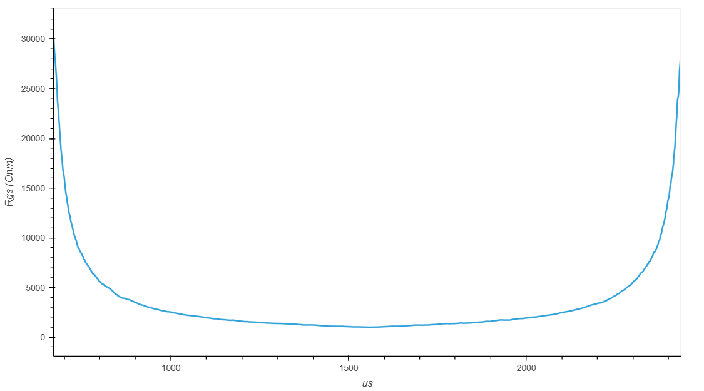

   Зависимость сопротивления перехода "база-эмиттер" от протекающего тока

Минимальное значение сопротивления перехода "база-эмиттер" составило 1008 Ом, максимальное 30185 Ом.
Нужно отметить, что при сопротивлении базы 6800 Ом минимальное сопротивление перехода "база-эмиттер"
значительно выше, чем при сопротивлении базы 680 Ом. Это можно объяснить тем, что в данном случае
переход "база-эмиттер" не достиг насыщения и открылся не полностью.

Падение напряжения на переходе "коллектор-эмиттер" изменяется как показано на рисунке ниже.
Когда переход "база-эмиттер" закрыт, переход "коллектор-эмиттер" имеет большое сопротивление
и все напряжение источника питания (порядка 8.5 В) падает на нем.
Падение напряжения на сопротивлении нагрузки близко к нулю.
Когда переход "база-эмиттер" открывается, сопротивление перехода "коллектор-эмиттер" снижается
и через переход начинает протекать ток. Когда переход "база-эмиттер" полностью открыт, он имеет
очень низкое сопротивление и на нем практически нет падения напряжения.
Все напряжение падает на сопротивлении нагрузки (Rn).

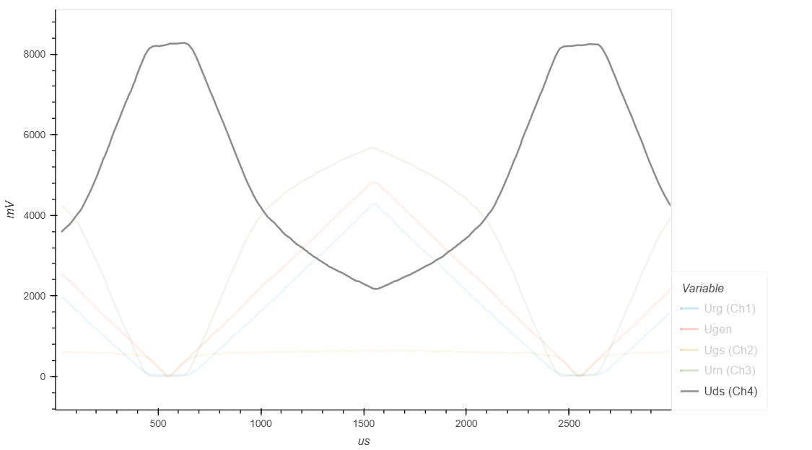

   Падение напряжения на переходе "коллектор-эмиттер" (осц. Ch3)

При этом, на сопротивлении нагрузки (Rn), наблюдается обратная картина.
Когда переход "база-эмиттер" закрыт, падения напряжения на сопротивлении нагрузки (Rn) нет.
Когда переход "база-эмиттер" открыт, значительная часть напряжения источника питания
падает на сопротивлении нагрузки (Rn).

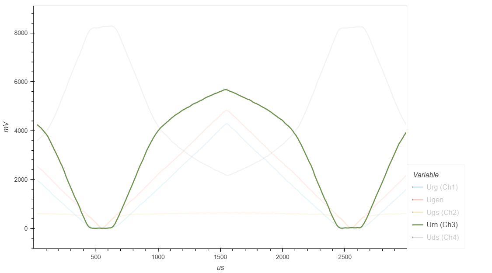

   Падение напряжения на сопротивлении нагрузки Rn (осц. Ch4)

Ниже представлен график изменения сопротивления перехода "коллектор-эмиттер"
на интервале времени, когда переход "база-эмиттер" открыт.

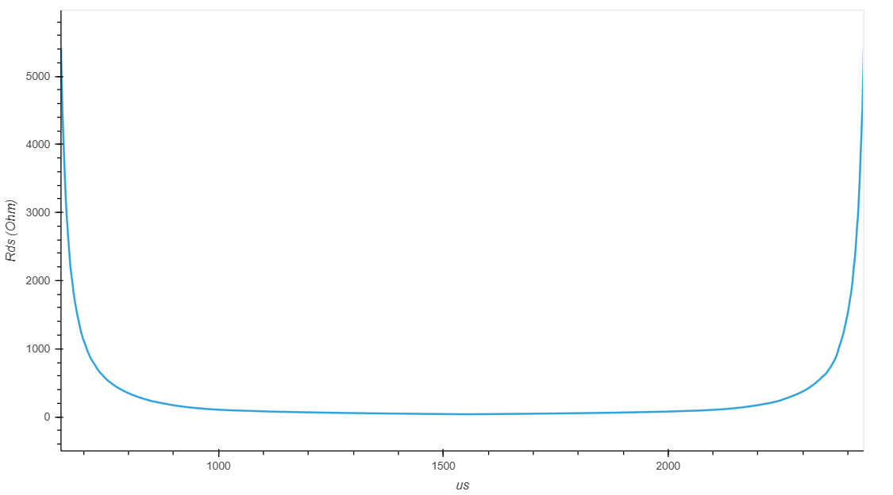

   Сопротивление перехода "коллектор-эмиттер"

Минимальное значение сопротивления перехода "коллектор-эмиттер" составило 38 Ом, максимальное 5429 Ом.

График изменения коэффициента усиления на интервале времени, когда переход "база-эмиттер" открыт
представлен на рисунке ниже.

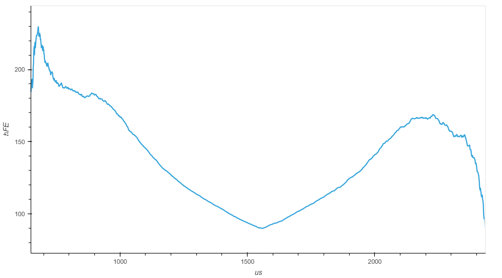

   Изменение коэффициента усиления (hFE)

Минимальное значение коэффициента усиления (hFE) составило 87, максимальное 229.

На данном графике нас больше всего интересуют плечи, т.к. на этих участках транзистор
работает в режиме усиления. Т.е., можно сказать, что коэффициента усиления (hFE)
данного транзистора, при работе в режиме усиления, составляет порядка 160-190.

Выводы
------

#. Напряжение "база-эмиттер" (Ugs), при котором открывается переход "коллектор-эмиттер" равно 0.7В

#. Падение напряжения на переходе "база-эмиттер" не изменяется, когда переход открыт.
   Т.е. сопротивление открытого перехода "база-эмиттер" изменяется в зависимости от тока.

#. Ток, проходящий через **открытый** переход "база-эмиттер",
   изменяется линейно в зависимости от приложенного напряжения.

#. Падение напряжения на на сопротивлении базы (Rb) при открытом переходе "база-эмиттер"
   изменяется линейно, в зависимости от приложенного напряжения.

#. При закрытом переходе "база-эмиттер", падение напряжения на переходе "коллектор-эмиттер"
   будет равно напряжению источника питания (~8.5В).

#. При превышении напряжения "база-эмиттер" (Ugs) 0.7В, сопротивление перехода "коллектор-эмиттер" будет снижаться,
   падение напряжения на переходе "коллектор-эмиттер" будет стремиться к нулю.

#. Напряжение напряжения на переходе "коллектор-эмиттер" изменяется линейно,
   когда на переход "база-эмиттер" подается напряжение от 0.7В до 2.3В.

#. На сопротивлении нагрузки (Rn) падение напряжения увеличится с нуля до 5.7В при Rn=6800 Ом,
   и до 7.76В при Rn=680 Ом. напряжение на Rn увеличилось до 5.7В при Rn=6800 Ом из-за того,
   что транзистор был открыт не полностью и имел небольшое сопротивление.

#. Значение hFE в режиме усиления составило 160 - 190.

#. При Rb = 680 Ом, минимальное сопротивление перехода "коллектор-эмиттер" составило 1.5 Ом
   и ток нагрузки достиг заданных значений 75 мА.

#. При Rb = 6800 Ом, минимальное сопротивление перехода "коллектор-эмиттер" составило 38 Ом
   и ток нагрузки **не достиг** заданных значений 75 мА из-за наличия сопротивления перехода "коллектор-эмиттер".

#. С увеличением тока "база-эмиттер", мощность рассеивания на переходе "база-эмиттер" становится сопоставимой
   с мощностью рассеивания на переходе "коллектор-эмиттер".
   Так, для Rb = 680 Ом, Pbe = 6 мВт, Pke = 18 мВт.

#. Мощность рассеивания на переходе "коллектор-эмиттер" в момент открытия транзистора достигает 238 мВт.

#. Какой оптимальный ток база-эмиттер для работы транзистора в режиме ключа?
   Если ток насыщения база-эмиттер порядка 3 мА, то можно взять с запасом 4 мА.

Вопросы
-------

#. Перестанет ли ток база-эмиттер изменяться линейно с управляющим напряжением?

Ссылки
------

#. `Google`_

.. _Google: https://www.Google.com

#. `Электроника для начинающих, Д.Забарило`_
#. `Транзистор полевой, биполярный, MOSFET, IGBT`_
#. `Транзисторный ключ от А до Я. Практика и теория. Полевые MOSFET и биполярные транзисторы`_
#. `Как правильно соединять транзисторы. На реальных примерах`_
#. `Transistor amplifier Part 1`_
#. `Transistor amplifier Part 2`_
#. `Усилители звука - это просто! Усилители звука с нуля для начинающих`_

.. _Усилители звука - это просто! Усилители звука с нуля для начинающих: https://www.youtube.com/watch?v=8gngn7YWtgA
.. _Transistor amplifier Part 2: https://www.youtube.com/watch?v=d8ft9JtEPKM
.. _Transistor amplifier Part 1: https://www.youtube.com/watch?v=QSrZmFjSXE8
.. _Как правильно соединять транзисторы. На реальных примерах: https://www.youtube.com/watch?v=UHsJlzZf0h4
.. _Транзисторный ключ от А до Я. Практика и теория. Полевые MOSFET и биполярные транзисторы: https://www.youtube.com/watch?v=e4qjSnRAO5s
.. _Транзистор полевой, биполярный, MOSFET, IGBT: https://www.youtube.com/watch?v=e2gYxgflioc
.. _Электроника для начинающих, Д.Забарило: https://diodov.net/elektronika-dlya-nachinayushhih/
