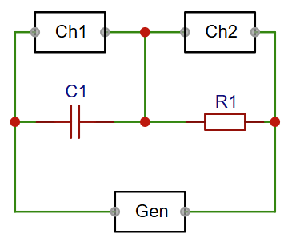
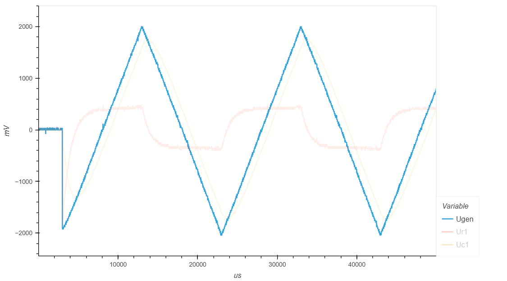
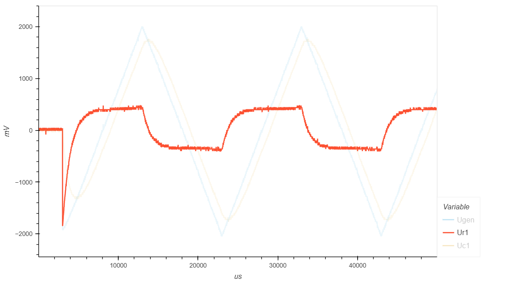
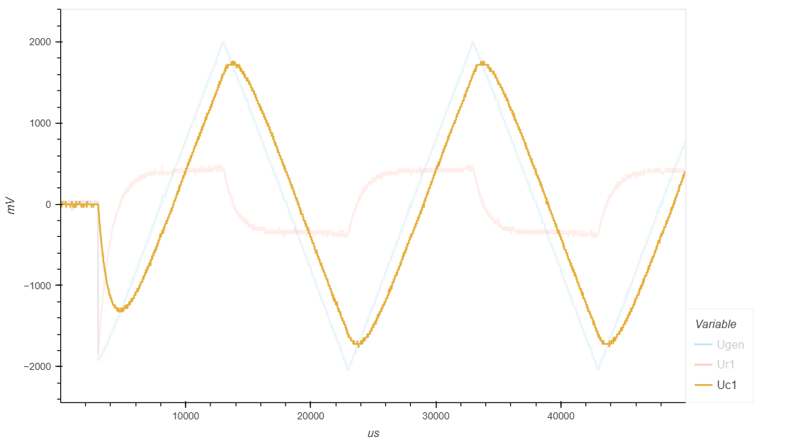
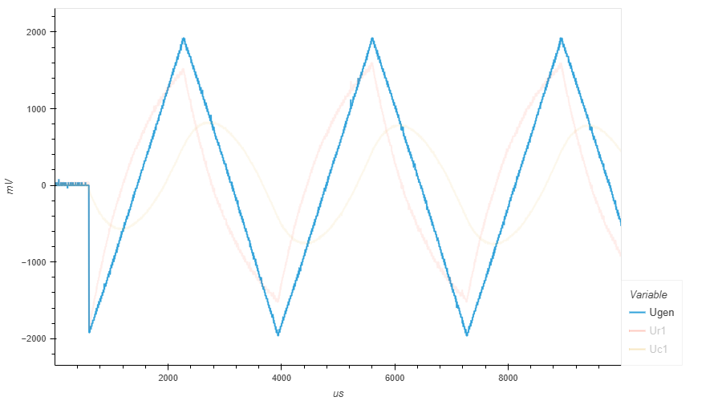
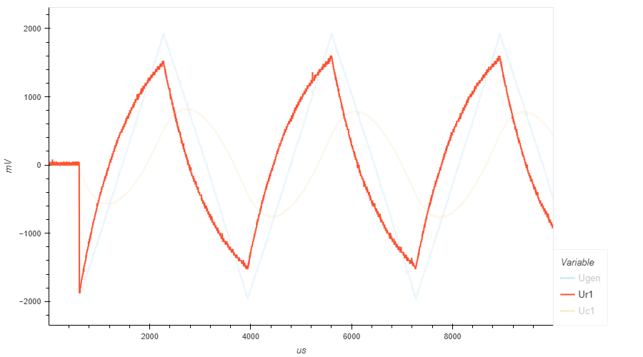
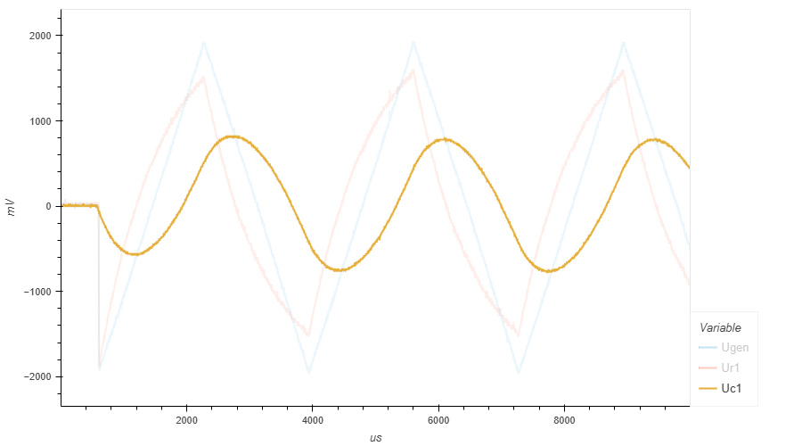

.. _rst_electronics_capacitor_capacitor:

Изучение свойств конденсатора
=============================

.. note::
    На основе курса `Электроника для начинающих, Д.Забарило`_

    - 9.1. Конденсаторы. Основные свойства
    - 9.2. Устройство плоскостного конденсатора
    - 9.3. Принцип работы конденсатора
    - 9.4. Виды конденсаторов: постоянный, переменный, подстроечный
    - 9.5. Маркировка конденсаторов. Числовое кодирование
    - 9.6. Напряжение конденсаторов. Классы точности конденсаторов
    - 9.7. Последовательно и параллельное соединение конденсаторов
    - 9.8. RC-цепь. Основные параметры и свойства

Задачи
------

#. Построить графики изменения тока и напряжения в RC цепи.
#. Экспериментально проверить расчетное время заряда конденсатора.

Введение
--------

Конденсатор - это электронный компонент, способный накапливать электрический заряд.
Конденсатор состоит из двух электродов, разделенных диэлектриком.

В цепи постоянного тока конденсатор эквивалентен разрыву цепи.
В момент изменения напряжения, конденсатор эквивалентен короткому замыканию.

Конденсатор стремится зарядиться до приложенного к нему напряжения.
Заряд (и разряд) конденсатора происходит по экспоненциальной кривой.

Закон изменения напряжения на обкладках конденсатора описывается формулой:

.. math::
    Uc = Uип(1 - e^{-t/RC})

где,

- **Uc** - напряжение на обкладках конденсатора
- **Uип** - напряжение источника питания
- **R** - сопротивление в цепи (Ом)
- **C** - емкость конденсатора (Ф)

Постоянная времени RC-цепи τ (тау) рассчитывается по формуле

.. math::
    τ = RC (сек.)

В таблице ниже приведены расчетные значения напряжения на обкладках конденсатора
в процентах от напряжения источника питания, в зависимости от времени, выраженном в τ.

===== ========
  τ    Uип (%)
===== ========
 1    63.212
 2    86.466
 3    95.021
 4    98.168
 5    99.326
===== ========

За время τ напряжение на обкладках конденсатора достигает 63.212% приложенного напряжения.

За время, равное 5τ напряжение достигает 99.326% напряжения источника питания.

Расчетный график зависимости напряжения на обкладках конденсатора от времени (τ) выглядит следующим образом:

.. figure:: images/capacitor_001_5tau.png
   :width: 500px
   :align: center

   График зависимости напряжения на обкладках конденсатора от τ

Описание опыта
--------------

Электрическая цепь состоит из резистора, конденсатора и генератора.

Два осциллографа (Ch1, Ch2) включены для измерения напряжения на резисторе и на конденсаторе.
Падение напряжения на резисторе будет косвенно показывать ток в цепи.

Принципиальная схема цепи, используемой в данной работе, изображена на рисунке ниже.

   Схема RC-цепи

- **R1** - 1 КОм
- **C1** - 1 мкФ
- **U** - 4 В
- **Gen1** - -2 В - +2 В (треугольник)

.. note::
    Заявленное, внутреннее сопротивление генератора 50 Ом.

    Если резистор R1 будет с низким сопротивлением, например, 100 Ом,
    то будет значительное падение напряжения на внутреннем сопротивлении генератора
    и на выходе генератора будет амплитуда меньше, чем была бы при большом сопротивлении R1.

    Поэтому R1 выбрано значительно больше внутреннего сопротивления генератора.

Ожидаемый результат
-------------------

#. В первый момент (когда напряжение пилы увеличивается от нуля) конденсатор ведет себя как КЗ.
#. На осциллографе конденсатора мы видим нулевое напряжение (т.к. это разрыв цепи и там нет падения напряжения).
#. На осциллографе резистора идет плавное увеличение напряжения (тока) по пиле.
#. Так происходит до полного заряда конденсатора.

Далее, ток в цепи уменьшается и конденсатор превращается в разрыв цепи.

На осциллографе конденсатора напряжение резко возрастает до текущего значения напряжения пилы
и увеличивается до 5В по пиле и затем уменьшается (согласно подаваемой пиле) до нулевого значения.

На осциллографе резистора падения напряжения нет (т.е. нет тока).
В момент времени, когда напряжение пилы переходит через ноль в отрицательную зону, конденсатор начинает сначала разряжаться, а затем заряжаться, т.е. время зарада конденсатора будет в два раза больше чем время его заряда в первый раз (когда он был полностью разряжен).
Происходит обратная картина.
В первый момент, после преодоления нуля конденсатор ведет себя как КЗ.
На осциллографе конденсатора мы видим нулевое напряжение (т.к. это разрыв цепи и там нет падения напряжения).
На осциллографе резистора идет плавное уменьшение напряжения (тока) по пиле.
Так происходит до полного заряда конденсатора.
Далее, ток в цепи исчезает и конденсатор превращается в разрыв цепи.
На осциллографе конденсатора напряжение резко уменьшается до текущего значения напряжения пилы и уменьшается до -5В по пиле и затем увеличивается (согласно подаваемой пиле) до нулевого значения.
На осциллографе резистора падения напряжения нет (т.е. нет тока).

3. Подготовить отчет

Для отчета захватить измеренные значения в момент включения конденсатора и сохранить в csv формате.
По полученным измерениям нарисовать график момента включения конденсатора и убедиться,
что первый заряд конденсатора длится в два раза быстрее, чтем все последующие.

Лабораторная работа
-------------------

Треугольный сигнал
^^^^^^^^^^^^^^^^^^

С генератора (Gen1) подается треугольный сигнал.

- Частота: 50 Гц
- Амплитуда: -2 В - +2 В

   Сигнал генератора Gen1

В момент подачи напряжения, конденсатор представляет собой короткое замыкание.
Через сопротивление R1 течет максимальный ток и все напряжение падает на сопротивлении R1.
По мере нарастания напряжения генератора, ток тоже возрастает до момента полного заряда конденсатора.
Когда конденсатор полностью заряжается, ток перестает возрастать,
но и не уменьшается, до тех пор, пока напряжение генератора не начинает уменьшаться.

   Падение напряжения на сопротивлении R1

Конденсатор стремится зарядиться до приложенного напряжения.
Сначала напряжение на конденсаторе падает.
Когда напряжение конденсатора и напряжение генератора выравниваются,
напряжение на конденсаторе начинает увеличиваться.

   Падение напряжения на конденсаторе C1

- :download:`Интерактивный график в формате html <docs/measurements_f050.html>`
- :download:`Измерения в формате csv для 50 Гц <docs/measurements_f050.csv>`

С генератора (Gen1) подается треугольный сигнал.

- Частота: 300 Гц
- Амплитуда: -2 В - +2 В

   Сигнал генератора Gen1

При увеличении частоты генератора, ток через резистор растет все время, пока растет напряжение генератора.
Это происходит потому что конденсатор не успевает полностью зарядиться.

   Падение напряжения на сопротивлении R1

   Падение напряжения на конденсаторе C1

- :download:`Интерактивный график в формате html <docs/measurements_f300.html>`
- :download:`Измерения в формате csv для 50 Гц <docs/measurements_f300.csv>`

Выводы
------

1. Чтобы полностью зарядить конденсатор можно уменьшить частоту.
   Тогда сигнал будет подаваться на обкладки конденсатора дольше и конденсатор сможет зарядиться полностью.

2. Пик напряжения на конденсаторе (зеленая кривая) совпадает с нулем напряжения на резисторе (оражневая кривая),
т.е. когда ток в цепи становится равным нулю (по этому нет и падения напряжения на резисторе.
В этот же момент кривая напряжения на конденсаторе (зеленая) пересекает кривую напряжения источника питания (синяя).
Это момент, когда напряжение на обкладках конденсатора становится равным напряжению источника питания
и они уравновешивают друг-друга. В этот момент ток не течет.

3. Пересечение кривых напряжения на конденсаторе (зеленая) и на резисторе (оранжевая) - это момент,
когда сопротивление конденсатора становится равным сопротивлению резистора и поэтому падение напряжения на этих элементах равны.

4. Конденсатор стремится зарядиться до напряжения источника питания.
На графике с частотой 100 Герц напряжение на конденсаторе (зеленая) достигает больших величин,
чем на графике с частотой 300 Герц, т.к. на частоте 100 Герц у конденсатора больше времени для заряда.

5. Если постоянно увеличивать напряжение на конденсаторе, то ток в цепи будет постоянным и равным току, который был в цепи в момент насыщения конденсатора. Ниже приведены соображения на этот счет.
На частоте 50 Гц напряжение на резисторе (оранжевая) достигает 0.5 В и больше не увеличивается. Т.е. максимальный ток в цепи 0.5 В / 1000 Ом = 0.5 мА.
На частоте 100 Гц напряжение на резисторе (оранжевая) достигает 0.8 В. Т.е. максимальный ток в цепи 0.8 В / 1000 Ом = 0.8 мА. А на частоте 300 Гц напряжение на резисторе (оранжевая) достигает 1.5 В. Т.е. максимальный ток в цепи 1.5 В / 1000 Ом = 1.5 мА.
Т.е. ток в цепи с конденсатором зависит от скорости нарастания напряжения. Чем выше скорость нарастания напряжения, тем больший ток  будет протекать через конденсатор в момент его насыщения. И когда наступит момент насыщения, если все еще продолжать увеличивать напряжение с той же скоростью, ток не будет уменьшаться.
Т.е. если быстро увеличивать напряжение и потом увеличивать его псотоянно, то ток в цепи будет постоянным с мосмента на котором он остановится в момент насыщения конденсатора.

Вопросы
-------

#. Расчет необходимого сопротивления и емкости для полного / неполного заряда конденсатора за полупериод.

Ссылки
------

#. `Электроника для начинающих, Д.Забарило`_
#. `CAPACITORS, Д.Забарило`_
#. `How does the RC circuit work REALLY, Д.Забарило`_
#. `How does the integrating and differentiating RC-circuit, Д.Забарило`_
#. `A capacitors voltage divider, Д.Забарило`_

.. _Электроника для начинающих, Д.Забарило: https://diodov.net/elektronika-dlya-nachinayushhih/
.. _CAPACITORS, Д.Забарило: https://www.youtube.com/watch?v=MgrxJsI3Imk
.. _How does the RC circuit work REALLY, Д.Забарило: https://www.youtube.com/watch?v=msJQH9pONKk
.. _How does the integrating and differentiating RC-circuit, Д.Забарило: https://www.youtube.com/watch?v=CVb7OWoLhWk
.. _A capacitors voltage divider, Д.Забарило: https://www.youtube.com/watch?v=wNwYNlvFsi8
