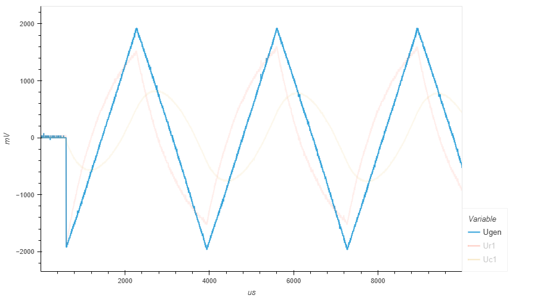
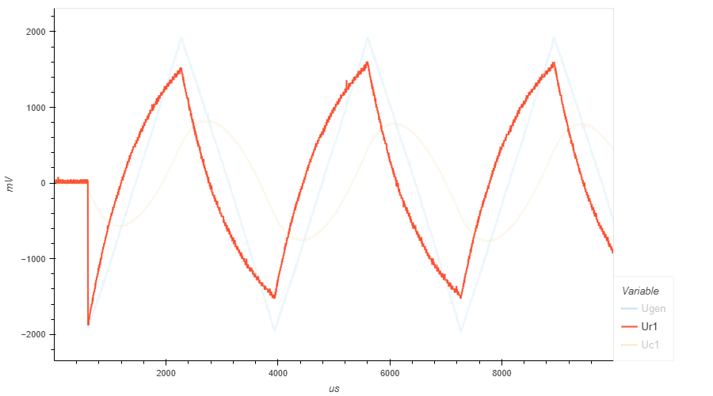
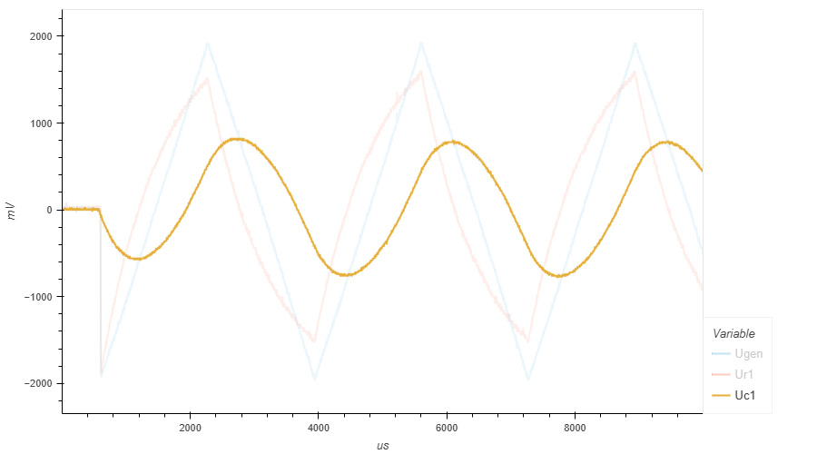

.. _rst_electronics_capacitor_capacitor:

Изучение свойств конденсатора
=============================

.. note::
    Данная статья задумывалась как лабораторная работа к курсу `Электроника для начинающих, Д.Забарило`_

    Лекции:

    - 9.1. Конденсаторы. Основные свойства
    - 9.2. Устройство плоскостного конденсатора
    - 9.3. Принцип работы конденсатора
    - 9.4. Виды конденсаторов: постоянный, переменный, подстроечный
    - 9.5. Маркировка конденсаторов. Числовое кодирование
    - 9.6. Напряжение конденсаторов. Классы точности конденсаторов
    - 9.7. Последовательно и параллельное соединение конденсаторов
    - 9.8. RC-цепь. Основные параметры и свойства

Задачи
------

#. Построить графики изменения тока и напряжения в RC цепи.
#. Экспериментально проверить расчетное время заряда конденсатора.

Введение
--------

Конденсатор - это электронный компонент, способный накапливать электрический заряд.
Конденсатор состоит из двух электродов, разделенных диэлектриком.

В цепи постоянного тока конденсатор эквивалентен разрыву цепи.
В момент изменения напряжения, конденсатор эквивалентен короткому замыканию.

Конденсатор стремится зарядиться до приложенного к нему напряжения.
Заряд (и разряд) конденсатора происходит по экспоненциальной кривой.

Закон изменения напряжения на обкладках конденсатора описывается формулой:

.. math::
    Uc = Uип(1 - e^{-t/RC})

где,

- **Uc** - напряжение на обкладках конденсатора
- **Uип** - напряжение источника питания
- **R** - сопротивление в цепи (Ом)
- **C** - емкость конденсатора (Ф)

Постоянная времени RC-цепи τ (тау) рассчитывается по формуле

.. math::
    τ = RC (сек.)

В таблице ниже приведены расчетные значения напряжения на обкладках конденсатора
в процентах от напряжения источника питания, в зависимости от времени, выраженном в τ.

===== ========
  τ    Uc (% от Uип)
===== ========
 1    63.212
 2    86.466
 3    95.021
 4    98.168
 5    99.326
===== ========

Так за время τ напряжение на обкладках конденсатора достигает 63.212% напряжения источника питания.

За время, равное 5τ напряжение достигает 99.326% напряжения источника питания.

Расчетный график зависимости напряжения на обкладках конденсатора от времени (τ) выглядит следующим образом:

.. figure:: images/capacitor_001_5tau.png
   :width: 500px
   :align: center

   График зависимости напряжения на обкладках конденсатора от τ

Описание опыта
--------------

Электрическая цепь состоит из резистора, конденсатора и генератора.

Два осциллографа (Ch1, Ch2) включены для измерения напряжения на резисторе и на конденсаторе.
Падение напряжения на резисторе будет косвенно показывать ток в цепи.

На рисунке ниже приведена принципиальная схема цепи.

.. figure:: images/capacitor_002_schematic.png
   :width: 250px
   :align: center

   Схема RC-цепи

- **R1** - 1 КОм
- **C1** - 1 мкФ
- **Gen** - -2 В - +2 В (треугольник / прямоугольные импульс)
- **Ch1, Ch2** - каналы осциллографа

.. note::
    Заявленное, внутреннее сопротивление используемого генератора 50 Ом.

    Если резистор R1 будет с низким сопротивлением, например, 100 Ом,
    то будет значительное падение напряжения на внутреннем сопротивлении генератора
    и на выходе генератора будет амплитуда меньше, чем была бы при большом сопротивлении R1.

    Поэтому R1 выбрано значительно больше внутреннего сопротивления генератора.

Лабораторная работа
-------------------

Прямоугольные импульсы
^^^^^^^^^^^^^^^^^^^^^^

С генератора (Gen) подаются прямоугольные импульсы:
    - Частота: 100 Гц
    - Амплитуда: -2 В - +2 В

.. figure:: images/capacitor_009_square_f100_gen.png
   :align: center

   Сигнал генератора Gen

На графике падения напряжения на сопротивлении R1 видно,
что в момент подачи импульса все напряжение падает на этом сопротивлении,
поскольку конденсатор представляет собой короткое замыкание.

По мере заряда конденсатора падение напряжения на сопротивлении R1 изменяется
(для первого импульса увеличивается от -2 В до 0 В).
И конденсатор становится эквивалентен разрыву цепи.

.. figure:: images/capacitor_010_square_f100_r1.png
   :align: center

   Падение напряжения на сопротивлении R1

На графике падения напряжения на конденсатора С1, приведенном ниже, наблюдается обратный процесс.
В момент подачи импульса падение напряжения равно нулю, а затем изменяется (от 0 В до ~ -2 В).

Для сопротивления 1 КОм и емкости конденсатора 1 мкФ время τ (тау) будет составлять 1 мсек.

.. math::
    τ = RC = 1000 * 0.000001 = 0.001 (сек.)

Для частоты 100 Гц один полупериод длится 5 мсек., что составляет 5τ.

Таким образом, конденсатор должен зарядиться за один полупериод до 99.326% от напряжения источника питания.
Это мы и наблюдаем на графике.

.. figure:: images/capacitor_011_square_f100_c1.png
   :align: center

   Падение напряжения на конденсаторе C1

С генератора (Gen) подаются прямоугольные импульсы:
    - Частота: 167 Гц
    - Амплитуда: -2 В - +2 В

На рисунке ниже приведены три графика (напряжение генератора,
падение напряжения на резисторе R1 и падение напряжения на конденсаторе C1).

На частоте 167 Гц полупериод составляет, примерно, 3 мсек., т.е. 3τ.
За время 3τ конденсатор должен зарядиться до 95.021% напряжения источника питания.
В нашем случае это 1.9 В. Это и наблюдается на графике.

.. figure:: images/capacitor_012_square_f167.png
   :align: center

   Сигнал генератора Gen и падения напряжения на R1 и C1

С генератора (Gen) подаются прямоугольные импульсы:
    - Частота: 500 Гц
    - Амплитуда: -2 В - +2 В

На следующем рисунке приведены графики напряжения генератора,
падение напряжения на резисторе R1 и падение напряжения на конденсаторе C1 для частоты 500 Гц.

На частоте 500 Гц полупериод составляет 1 мсек., т.е. 1τ.
За время τ конденсатор должен зарядиться до 63.212% напряжения источника питания.
В нашем случае, для напряжения источника питания 2 В это 1.264 В. Это мы и наблюдаем на графике.

.. figure:: images/capacitor_013_square_f500.png
   :align: center

   Сигнал генератора Gen и падения напряжения на R1 и C1

.. figure:: images/capacitor_014_square_f500_more_waves.png
   :align: center

   Сигнал генератора Gen и падения напряжения на R1 и C1

- :download:`Интерактивный график для 100 Гц в формате html <docs/measurements_square_f100.html>`
- :download:`Измерения в формате csv для 100 Гц <docs/measurements_square_f100.csv>`
- :download:`Интерактивный график для 167 Гц в формате html <docs/measurements_square_f167.html>`
- :download:`Измерения в формате csv для 167 Гц <docs/measurements_square_f167.csv>`
- :download:`Интерактивный график для 500 Гц в формате html <docs/measurements_square_f500.html>`
- :download:`Измерения в формате csv для 500 <docs/measurements_square_f500.csv>`

Треугольный сигнал
^^^^^^^^^^^^^^^^^^

С генератора (Gen) подается треугольный сигнал:
    - Частота: 50 Гц
    - Амплитуда: -2 В - +2 В

.. figure:: images/capacitor_003_triangle_f050_gen.png
   :align: center

   Сигнал генератора Gen

В момент подачи напряжения, конденсатор представляет собой короткое замыкание.
Через сопротивление R1 течет максимальный ток и все напряжение падает на сопротивлении R1.
По мере нарастания напряжения генератора, ток тоже возрастает до момента полного заряда конденсатора.
Когда конденсатор полностью заряжается, ток перестает возрастать,
но и не уменьшается, до тех пор, пока напряжение генератора не начинает уменьшаться.

.. figure:: images/capacitor_004_triangle_f050_r1.png
   :align: center

   Падение напряжения на сопротивлении R1

Конденсатор стремится зарядиться до приложенного напряжения.
Сначала напряжение на конденсаторе падает.
Когда напряжение конденсатора и напряжение генератора выравниваются,
напряжение на конденсаторе начинает увеличиваться.

.. figure:: images/capacitor_005_triangle_f050_c1.png
   :align: center

   Падение напряжения на конденсаторе C1

- :download:`Интерактивный график для 50 Гц в формате html <docs/measurements_triangle_f050.html>`
- :download:`Измерения в формате csv для 50 Гц <docs/measurements_triangle_f050.csv>`

С генератора (Gen) подается треугольный сигнал:
    - Частота: 300 Гц
    - Амплитуда: -2 В - +2 В

   Сигнал генератора Gen

При увеличении частоты генератора, ток через резистор растет все время, пока растет напряжение генератора.
Это происходит потому что конденсатор не успевает полностью зарядиться.

   Падение напряжения на сопротивлении R1

   Падение напряжения на конденсаторе C1

- :download:`Интерактивный график для 300 Гц в формате html <docs/measurements_triangle_f300.html>`
- :download:`Измерения в формате csv для 300 Гц <docs/measurements_triangle_f300.csv>`

Выводы
------

#. Расчетные значения напряжения на обкладках конденсатора совпадают с результатами измерений.

#. Пик напряжения на конденсаторе (зеленая кривая) совпадает с нулем напряжения на резисторе (оранжевая кривая),
т.е. когда ток в цепи становится равным нулю (по этому нет и падения напряжения на резисторе.
В этот же момент кривая напряжения на конденсаторе (зеленая) пересекает кривую напряжения источника питания (синяя).
Это момент, когда напряжение на обкладках конденсатора становится равным напряжению источника питания
и они уравновешивают друг-друга. В этот момент ток не течет.

#. Пересечение кривых напряжения на конденсаторе (зеленая) и на резисторе (оранжевая) - это момент,
когда сопротивление конденсатора становится равным сопротивлению резистора и поэтому падение напряжения на этих элементах равны.

#. Если постоянно увеличивать напряжение на конденсаторе, то ток в цепи будет постоянным и равным току, который был в цепи в момент насыщения конденсатора. Ниже приведены соображения на этот счет.
На частоте 50 Гц напряжение на резисторе (оранжевая) достигает 0.5 В и больше не увеличивается. Т.е. максимальный ток в цепи 0.5 В / 1000 Ом = 0.5 мА.
На частоте 100 Гц напряжение на резисторе (оранжевая) достигает 0.8 В. Т.е. максимальный ток в цепи 0.8 В / 1000 Ом = 0.8 мА. А на частоте 300 Гц напряжение на резисторе (оранжевая) достигает 1.5 В. Т.е. максимальный ток в цепи 1.5 В / 1000 Ом = 1.5 мА.
Т.е. ток в цепи с конденсатором зависит от скорости нарастания напряжения. Чем выше скорость нарастания напряжения, тем больший ток  будет протекать через конденсатор в момент его насыщения. И когда наступит момент насыщения, если все еще продолжать увеличивать напряжение с той же скоростью, ток не будет уменьшаться.
Т.е. если быстро увеличивать напряжение и потом увеличивать его постоянно, то ток в цепи будет постоянным с момента на котором он остановится в момент насыщения конденсатора.

#. Как и предполагалось, первый заряд конденсатора (когда он полностью разряжен) максимальный, второй минимальный.
(Теоретическое предположение: Теоретически, первый заряд конденсатора, когда он был полностью разряжен, будет максимальным.
Второй заряд на втором полупериоде будет минимальным, поскольку конденсатор будет разряжаться максимальное время и на заряд останется меньше всего времени.)
Однако, сдедующее предположение не подтвердилось. Все последующие заряды, приметно, одинаковые, между максимальным и минимальным.
(Теоретическое предположение: Последующие заряды будут варьировать в пределах от первого максимального заряда, до второго минимального заряда.)

Ссылки
------

#. `Электроника для начинающих, Д.Забарило`_
#. `CAPACITORS, Д.Забарило`_
#. `How does the RC circuit work REALLY, Д.Забарило`_
#. `How does the integrating and differentiating RC-circuit, Д.Забарило`_
#. `A capacitors voltage divider, Д.Забарило`_
#. `Учимся читать электрические схемы с конденсаторами, Д.Забарило`_

.. _Электроника для начинающих, Д.Забарило: https://diodov.net/elektronika-dlya-nachinayushhih/
.. _CAPACITORS, Д.Забарило: https://www.youtube.com/watch?v=MgrxJsI3Imk
.. _How does the RC circuit work REALLY, Д.Забарило: https://www.youtube.com/watch?v=msJQH9pONKk
.. _How does the integrating and differentiating RC-circuit, Д.Забарило: https://www.youtube.com/watch?v=CVb7OWoLhWk
.. _A capacitors voltage divider, Д.Забарило: https://www.youtube.com/watch?v=wNwYNlvFsi8
.. _Учимся читать электрические схемы с конденсаторами, Д.Забарило: https://www.youtube.com/watch?v=Bjio-jXVH6M
