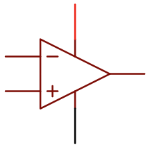
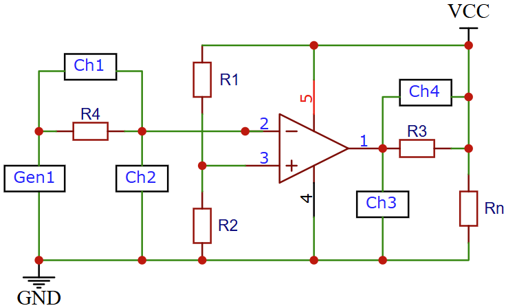
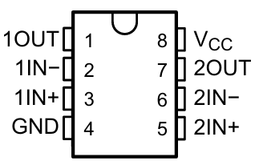
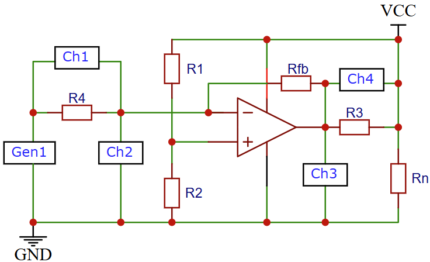

.. _rst_electronics_comparator_comparator:

Изучение свойств компаратора
============================

.. note::
    Данная статья задумывалась как лабораторная работа к курсу `Электроника для начинающих, Д.Забарило`_

    Уроки:

    - 28.1 Компаратор. Устройство. Принцип работы
    - 28.2 Датчики уровня освещенности на компараторе

    Бесплатные материалы по теме:

    #. `Что такое выход с Открытым Коллектором, открытым стоком`_

Загрузки:

Задачи
------

#. Изучение принципа действия компаратора с открытым коллектором.
#. Исследовать влияние сопротивления обратной связи на момент срабатывания компаратора.

Введение
--------

Обозначение компаратора на принципиальных схемах:

Компаратор имеет следующие выходы:

- Инвертирующий вход (-)
- Не инвертирующий вход (+)
- Два вывода для для подключения питания. Питание можно подключать как однополярное, так и двухполярное.
- Выход, который работает следующим образом (для компаратора с открытым коллектором):

    - :math:`U(+) > U(-)` - выход компаратора закрыт (между выходом и землей большое сопротивление)
    - :math:`U(+) < U(-)` - выход компаратора открыт (выход и земля замкнуты)

.. note::
    Управление осуществляется напряжением, т.е. можно использовать большие сопротивления
    для делителя напряжения, который подает управляющее напряжение на входы.

Описание опыта
--------------

С помощью схемы, приведенной ниже, измерим ток и напряжение на входе и на выходе компаратора.
И определим влияние уровней напряжения, поданных на входы компаратора на сопротивление выхода компаратора
относительно земли.

   Схема подключения компаратора без использования обратной связи

- **VCC** - 9 В
- **Comparator** - LM393P
- **U(Gen1)** - 0 В ... +5 В (треугольник) подается от генератора Gen1 с частотой 500 Гц.
- **U(+)** = 4.5 В - пороговое напряжение, заданное делителем напряжения R1/R2.
- **R1** = 10 КОм - сопротивление делителя напряжения.
- **R2** = 10 КОм - сопротивление делителя напряжения.
- **R3** = 100 Ом - токоограничивающий резистор. В данном случае служит для определения тока выходной цепи компаратора.
- **R4** = 100 Ом - токоограничивающий резистор. В данном случае служит для определения тока выходной цепи компаратора.
- **Rn** = 100 Ом - сопротивление нагрузки.

Характеристики компаратора LM393P (в корпусе DIP-8)
    - **Напряжение питания** = 	+2В…36В, ±1В…18В
    - **Входное напряжение (max)** = 36В
    - **Выходное напряжение (max)** = 36В
    - **Выходной ток (max)** = 20 мА

   Корпус компаратора LM393P (DIP-8)

На следующей схеме добавлено сопротивление обратной связи (Rfd), с помощью которого
будем изменять порог срабатывания компаратора.

   Схема подключения компаратора с обратной связью

Лабораторная работа
-------------------

Выводы
------

Вопросы
-------

Ссылки
------

#. `Google`_

.. _Google: https://www.Google.com

#. `Электроника для начинающих, Д.Забарило`_
#. `Что такое выход с Открытым Коллектором, открытым стоком`_

.. _Что такое выход с Открытым Коллектором, открытым стоком: https://www.youtube.com/watch?v=cpXESVwulyw
.. _Электроника для начинающих, Д.Забарило: https://diodov.net/elektronika-dlya-nachinayushhih/
