.. _rst_electronics_diode_diode:

Изучение свойств диода
======================

.. note::
    На основе курса `Электроника для начинающих, Д.Забарило`_

    Уроки:

    - 8.1. Светодиоды. Принцип работы. УГО.
    - 8.2. Вольт-амперная характеристика (ВАХ). Линейная и нелинейная зависимости. Прямая ветвь ВАХ.
    - 8.3. Обратная ветвь ВАХ.
    - 8.4. ВАХ светодиодов. Расчет параметров токоограничивающих резисторов.
    - 8.5. Макетные платы. Виды и применение макетных плат.
    - 8.6. Первая схема на макетной плате.
    - 8.7. Последовательно соединение светодиодов. Баланс мощностей.
    - 8.8. Параллельное соединение светодиодов. Обоснование выбора схемы соединения светодиодов.
    - 8.9. Двухцветные и RGB-светодиоды.

Задачи
------

#. Построить графики зависимости тока от напряжения в цепи с диодом.
#. Экспериментально проверить заявленное напряжение открытия светодиодов разных цветов.

Введение
--------

Диоды — это полупроводниковые приборы, состоящие из одного p - n перехода,
ток через который проходит в одном направление и не проходит в обратном.

Описание опыта
--------------

Принципиальная схема цепи, используемой в данной работе, изображена на рисунке ниже.

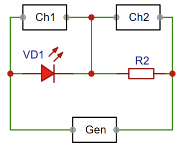

   Схема цепи с диодом

- **R1** - 1 КОм
- **VD1** - светодиод 5мм (красный, желтый, зеленый, синий). Рабочий ток 20мА
- **Gen** - -4 В; +4 В (пилообразный)
- **Ch1, Ch2** - каналы осциллографа

Измеренные тестером значения открытия светодиодов:

- Красный - 1.98 В
- Желтый  - 1.98 В
- Зеленый - 2.08 В
- Синий   - 2.72 В

Лабораторная работа
-------------------

В первом опыте используется красный светодиод.

С генератора подается пилообразный сигнал частотой **500 Гц** и амплитудой **4 В**.

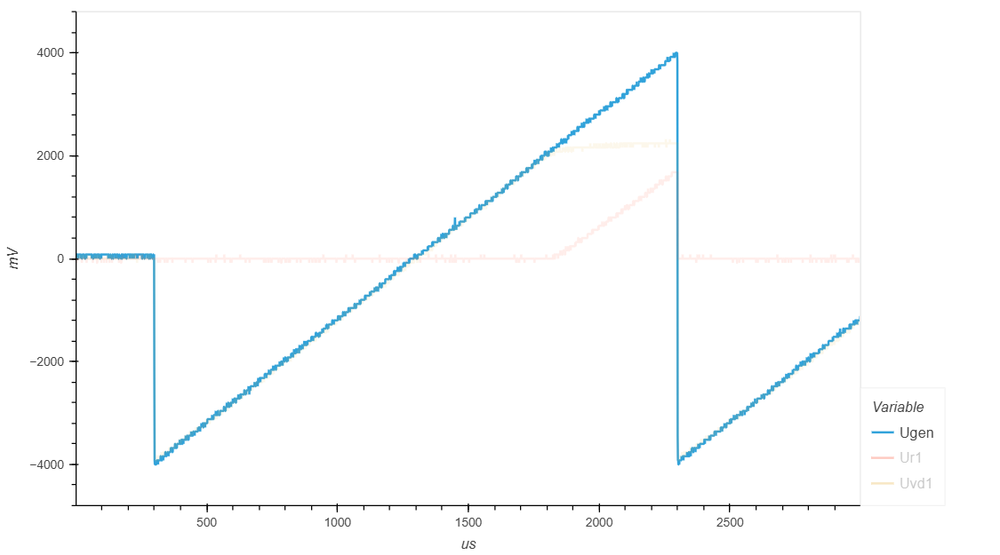

   Сигнал генератора Gen

На графике ниже показано падение напряжения на сопротивлении R1.

При отрицательной полуволне ток в цепи отсутствует и падения напряжения на сопротивлении R1 нет.
При достижении напряжения источника питания **2 В** диод начинает открываться
и ток начинает течь.

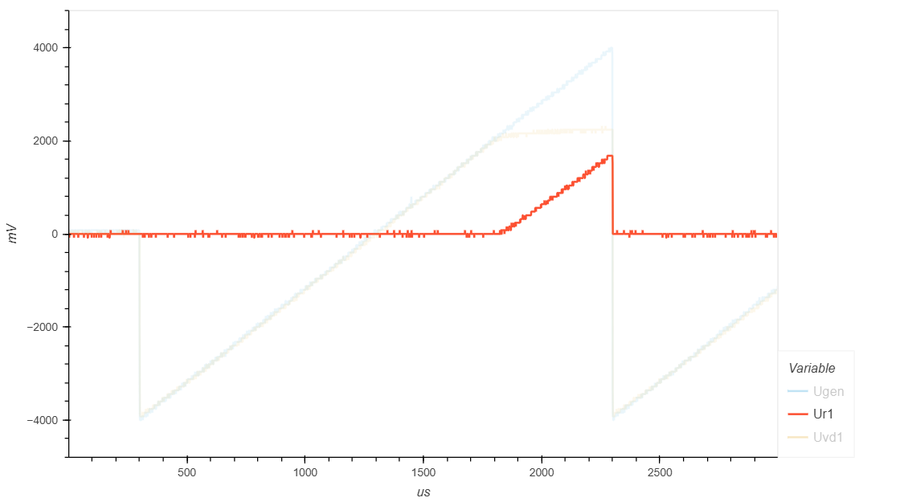

   Падение напряжения на сопротивлении R1

На следующем графике показано падение напряжения на красном светодиоде.

При напряжении источника питания (генератора) 2 В p-n переход открывается
и далее падение напряжения изменяется незначительно.

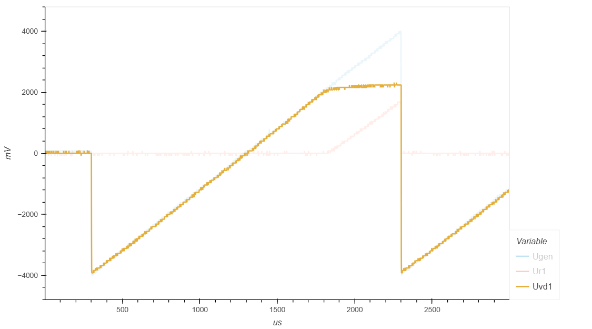

   Падение напряжения на красном светодиоде

Имея данные падения напряжения на резисторе R1 мы можем рассчитать ток в цепи
и построить график зависимости тока от напряжения (Вольт-Амперная Характеристика).

График зависимости зависимости тока от напряжения приведен ниже.
Н этом графике видно, что диот начинает открываться при напряжении генератора 2.1 В.

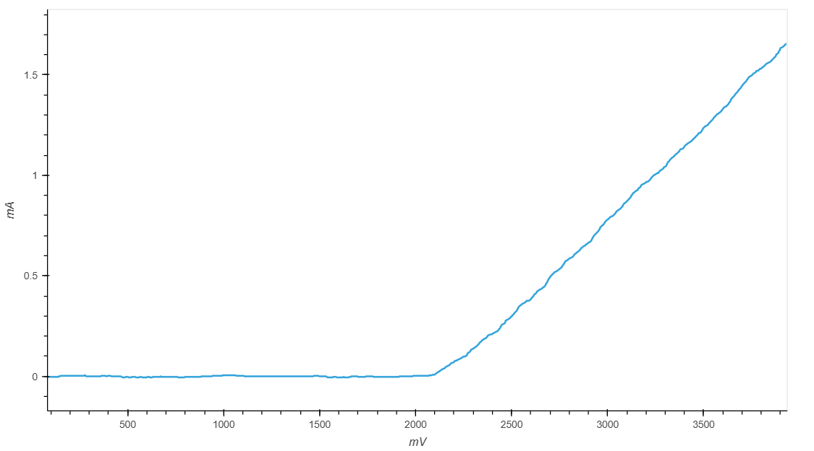

   Зависимость тока от напряжения (ВАХ) для красного светодиода

Имея ток цепи и падение напряжения на светодиоде мы можем рассчитать сопротивление светодиода.

График сопротивления светодиода приведен ниже.

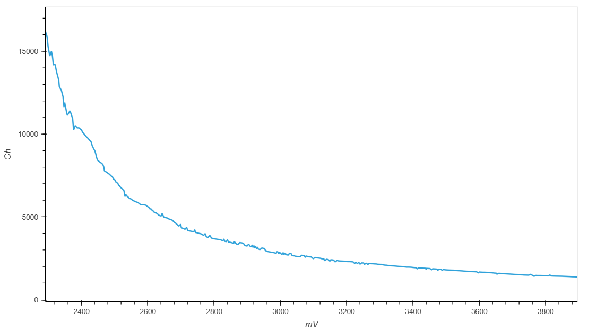

   Сопротивление красного светодиода

Результаты измерений и графики зависим тока от напряжения для светодиодов других цветов приведены на рисунках ниже.

На графиках видно, что зеленый и желтый светодиоды открываются при напряжении **2.1 В**,
так же как и красный светодиод.

А синий светодиод открывается при напряжении **2.9 В**.

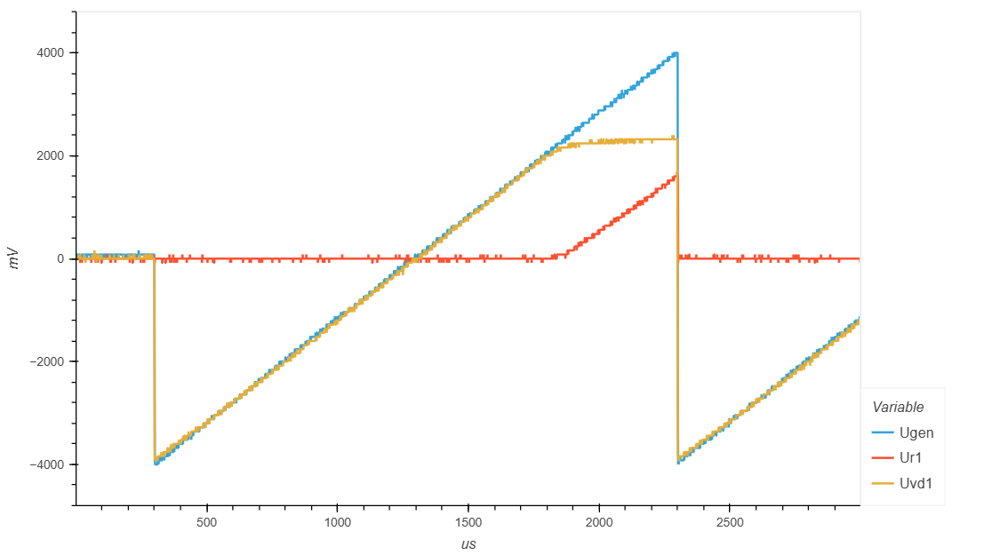

   Зеленый светодиод. Напряжение генератора и падения напряжения на R1 и VD1

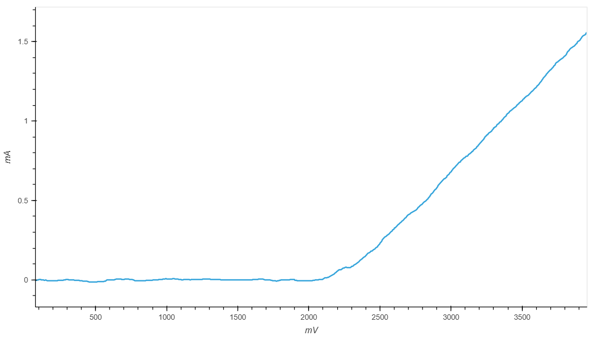

   Зеленый светодиод. Зависимость тока от напряжения (ВАХ)

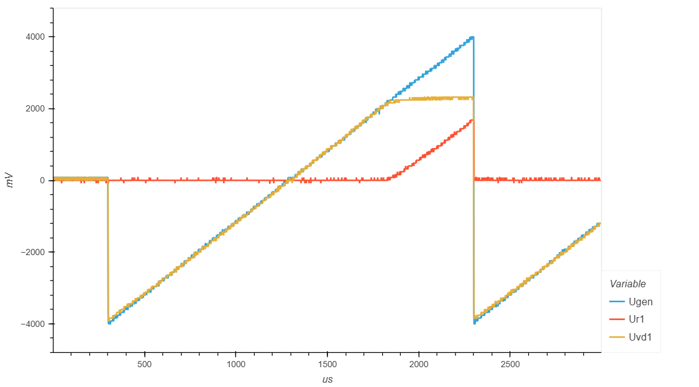

   Желтый светодиод. Напряжение генератора и падения напряжения на R1 и VD1

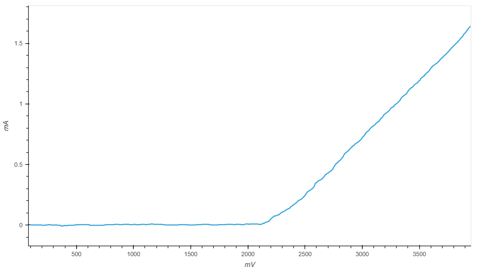

   Желтый светодиод. Зависимость тока от напряжения (ВАХ)

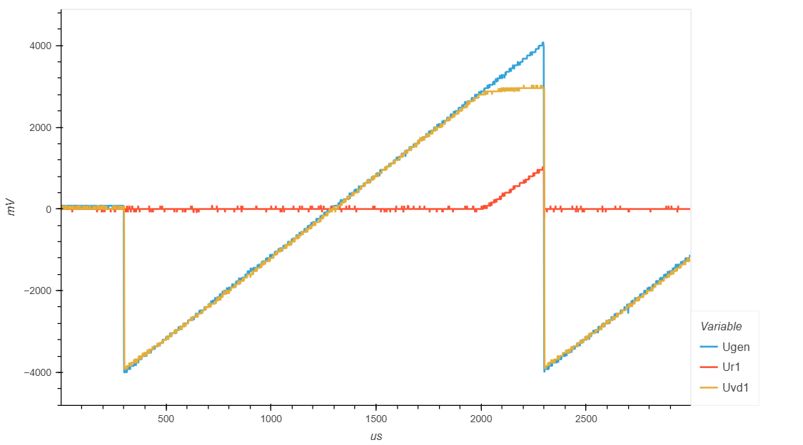

   Синий светодиод. Напряжение генератора и падения напряжения на R1 и VD1

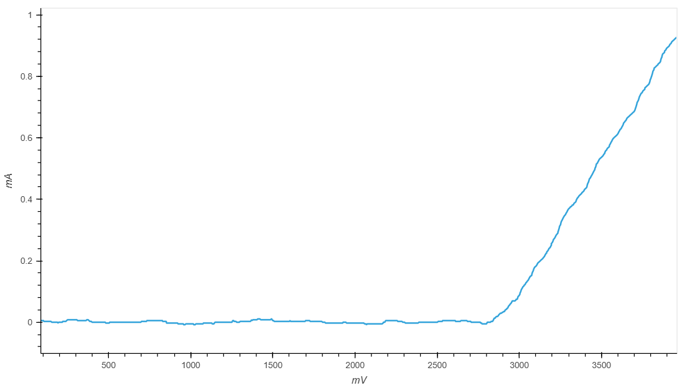

   Синий светодиод. Зависимость тока от напряжения (ВАХ)

- :download:`Интерактивный график ВАХ, красный светодиод <docs/vd_red_iu.html>`
- :download:`Интерактивный график ВАХ, зеленый светодиод <docs/vd_green_iu.html>`
- :download:`Интерактивный график ВАХ, желтый светодиод <docs/vd_yellow_iu.html>`
- :download:`Интерактивный график ВАХ, синий светодиод <docs/vd_blue_iu.html>`

Выводы
------

#. Напряжение открытия синего светодиода значительно выше чем красного, желтого и зеленого.
#. После открытия диода, падение на нем практически не меняется, т.е. он работает как стабилизатор напряжения.

Ссылки
------

#. `Электроника для начинающих, Д.Забарило`_

.. _Электроника для начинающих, Д.Забарило: https://diodov.net/elektronika-dlya-nachinayushhih/
