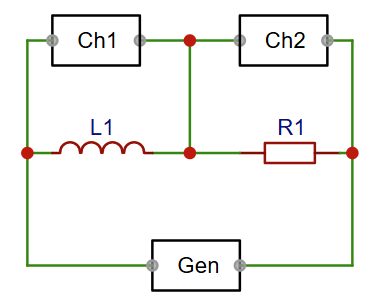
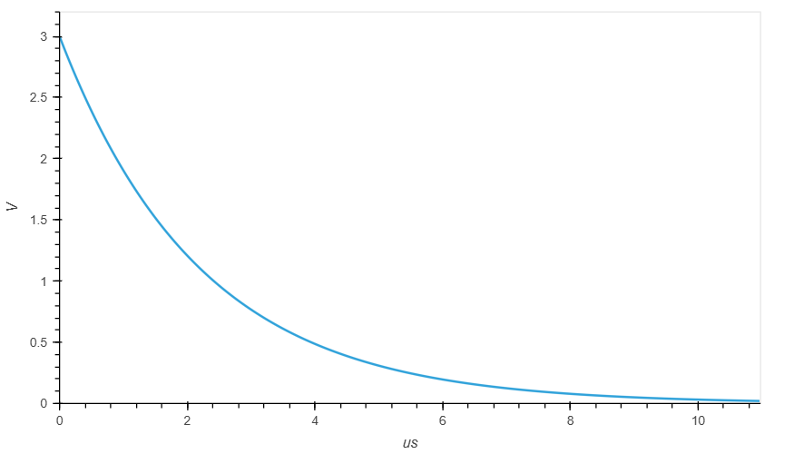
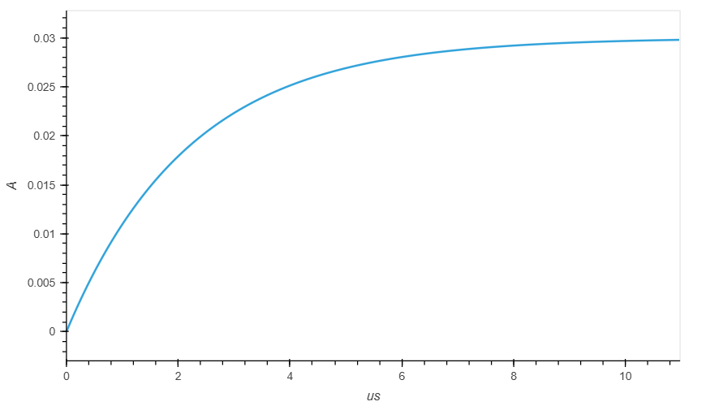
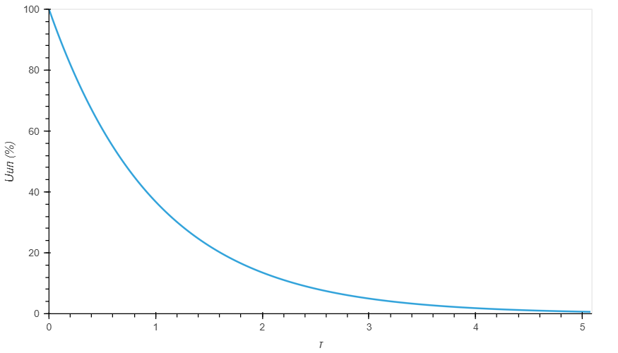
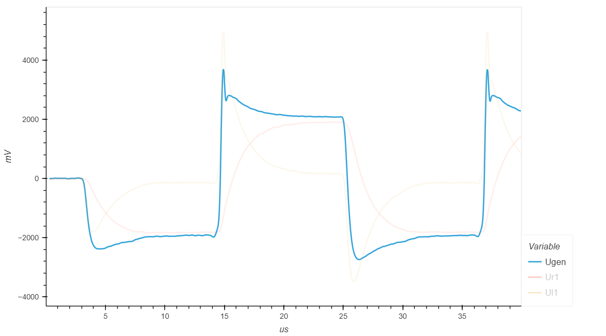
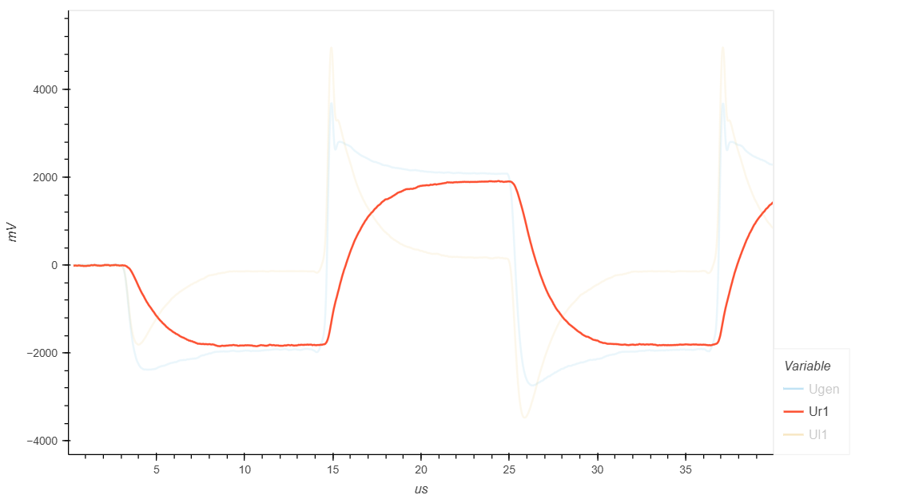
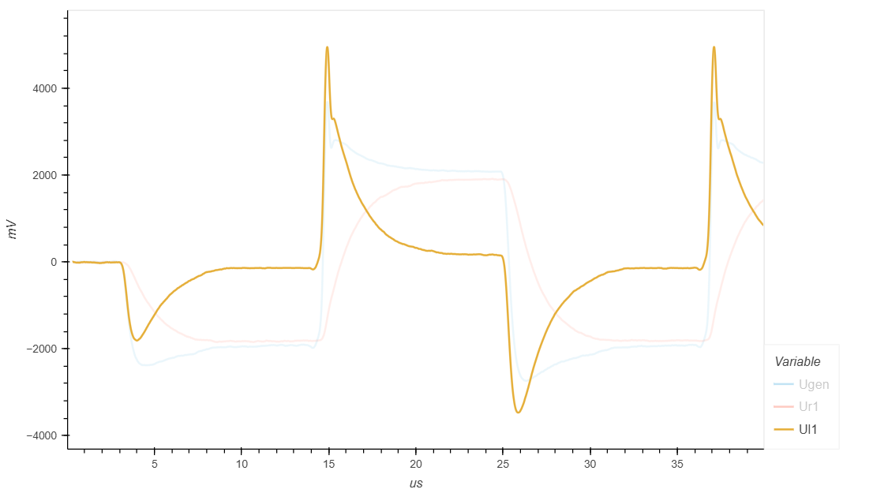
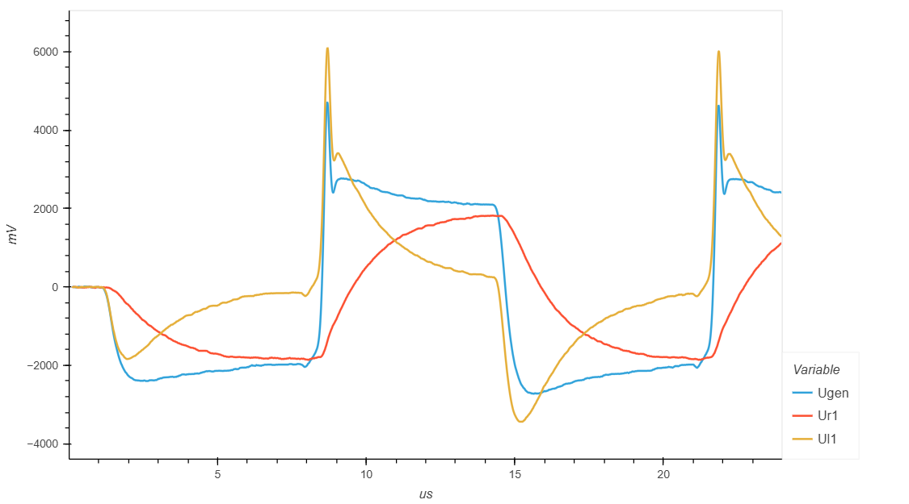
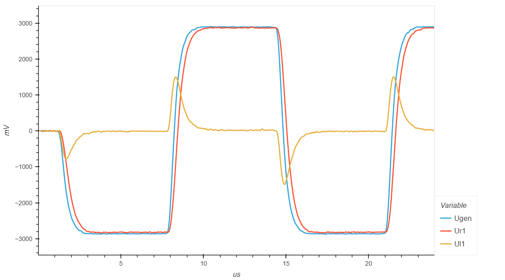

.. _rst_electronics_inductance_inductance:

Изучение свойств индуктивности
==============================

.. note::
    Данная статья задумывалась как лабораторная работа к курсу `Электроника для начинающих, Д.Забарило`_

    Уроки:

    - 10.1. Магнитное поле. Постоянный магнит. Магнитная проницаемость.
    - 10.2. Электромагнитное реле. Устройство. Принцип работы.
    - 10.3. Практическое применение реле.
    - 10.4. Электромагнитная индукция. ЭДС самоиндукции. Индуктивность.
    - 11.1. Переменный ток. Период. Частота. Действующее (эффективное) значение.
    - 11.2. Согласное и встречное включение источников питания.
    - 11.3. Свойства синусоидальной функции.

Задачи
------

#. Построить графики зависимости тока от напряжения в цепи с катушкой индуктивности.
#. Экспериментально проверить расчетные значения напряжения на индуктивности.

Введение
--------

На катушке индуктивности напряжение может мгновенно измениться, а ток не может.
При отключении питания на катушке индуктивности наводится обратное напряжение.
Обратное напряжение может в несколько раз превышать прямое.

Описание опыта
--------------

Для опыта используется схема с генератором, катушкой индуктивности и сопротивлением.

Принципиальная схема цепи, используемой в данной работе, изображена на рисунке ниже.

   Схема LC-цепи

- **R1** - 100 Om / 1 КOm
- **L1** - 220 mkH (0.000220 H)
- **Gen** - -3 В - +3 В (прямоугольные импульсы)
- **Ch1, Ch2** - каналы осциллографа

При подаче импульса, напряжение должно мгновенно увеличиться
до поданного значения и постепенно уменьшаться.

Ток в момент подачи импульса должен быть равен нулю и постепенно увеличиваться.

Постоянная времени RL-цепи τ (тау) рассчитывается по формуле:

.. math::
    τ = L/R (сек.)

В таблице ниже приведены расчетные значения напряжения на индуктивности
в процентах от напряжения источника питания, в зависимости от времени, выраженном в τ.

===  =========
 τ    Uc (% от Uип)
===  =========
  1  36.787
  2  13.533
  3   4.978
  4   1.831
  5   0.673
===  =========

Закон изменения напряжения на индуктивности описывается формулой:

.. math::
    Ul = Uип * e^{-t/τ} = Uип * e^{-tR/L}

Закон изменения тока на индуктивности описывается формулой:

.. math::
    Ul = (Uип/R) * (1 - e^{-t/τ}) = (Uип/R) * (1 - e^{-tR/L})

Ниже приведены графики изменения тока и напряжения для заданных параметров цепи.

- **R1** - 100 Om
- **L1** - 220 mkH (0.000220 H)

Постоянная времени τ (тау) для заданных значений равна 2.2 микросекунды.
Тогда 5τ = 11 микросекунд.

.. math::
    τ = L/R = 0.000220 / 100 = 0.0000022 (сек.) = 2.2 (микросекунд)

   График зависимости напряжения на индуктивности от времени

   График зависимости тока в RL цепи от времени

Ниже приведен график зависимости напряжения на индуктивности от τ

   График зависимости напряжения на индуктивности от τ

Рассчитаем необходимую частоту импульсов чтобы на полупериод приходилось 3τ и 5τ.
И рассчитаем значения напряжения на индуктивности для 3τ и 5τ.

Формула зависимости частоты от периода приведена ниже.

.. math::
    F = 1/T (Гц)

Расчетные значения для 3τ:
    F = 75757.6 Гц

    Ul = 0.149 В

Расчетные значения для 5τ:
    F = 45454.5 Гц

    Ul = 0.02 В

Лабораторная работа
-------------------

С генератора (Gen) подаются прямоугольные импульсы:
    - Частота: 45 КГц
    - Амплитуда: -3 В - +3 В

Сопротивление R1 = 100 Ом

.. note::
    Заявленное, внутреннее сопротивление используемого генератора 50 Ом.

    Поскольку R1 имеет сопротивление 100 Ом,
    наблюдается значительное падение напряжения на внутреннем сопротивлении генератора
    и на выходе генератора амплитуда меньше -3 В / +3 В.

   Сигнал генератора Gen

На графике падения напряжения на сопротивлении R1 видно,
что в момент подачи импульса все напряжение падает индуктивности,
поскольку индуктивность, в первый момент времени, представляет собой разрыв цепи.

Далее, реактивное сопротивление индуктивности уменьшается и через нее начинает протекать ток.
Падение напряжения на сопротивлении R1 увеличивается.
Катушка становится эквивалентна короткому замыканию и все напряжение падает на сопротивлении R1.

   Падение напряжения на сопротивлении R1

На графике падения напряжения на индуктивности L1, видно, что в момент подачи импульса
падение напряжения максимальное, а затем изменяется примерно до -0.15 В,
что, примерно, соответствует расчетам.

   Падение напряжения на индуктивности L1

С генератора (Gen) подаются прямоугольные импульсы:
    - Частота: 75 КГц
    - Амплитуда: -3 В - +3 В

Сопротивление R1 = 100 Ом

При частоте 75 КГц на полупериод приходится 3τ.
Падение напряжения на индуктивности более пологое.

   Сигнал генератора Gen и падения напряжения на R1 и L1

Дополнительно рассмотрим схему с сопротивлением 1 КОм.
В данном случае влияние внутреннего сопротивления генератора будет значительно меньше.
Но при этом, время 5τ будет составлять уже 1.1 микросекунду.

С генератора (Gen) подаются прямоугольные импульсы:
    - Частота: 75 КГц
    - Амплитуда: -3 В - +3 В

Сопротивление R1 = 1 КОм

   Сигнал генератора Gen и падения напряжения на R1 и L1

Выводы
------

#. Результаты измерений, в целом, подтверждают ожидания.

Ссылки
------

#. `Электроника для начинающих, Д.Забарило`_
#. `Переходные процессы в простейшей RL-цепи`_

.. _Электроника для начинающих, Д.Забарило: https://diodov.net/elektronika-dlya-nachinayushhih/
.. _Переходные процессы в простейшей RL-цепи: https://eelib.narod.ru/toe/Novg_2.01/15/Ct15-3.htm
