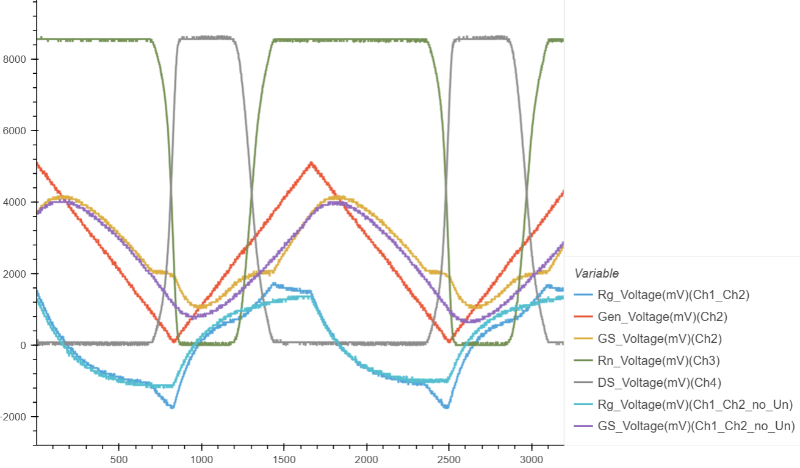

.. _rst_mosfet_mosfet:

Изучение свойств полевого транзистора
=====================================

.. note::
    На основе курса `Электроника для начинающих, Д.Забарило`_

    - 22.2 Полевые транзисторы с изолированным затвором
    - 22.3 Основные параметры и проерка работы MOSFET
    - 22.4 Исследование работы MOSFET в режиме ключа

Задачи
------

#. Изучить свойства полевого транзистора с изолированным затвором с индуцированным каналом.
#. Построить графики зависимости тока и напряжения на участке Сток-Исток от тока и напряжения на участке Затвор-Исток.
#. Проверить теоретическое значение напряжения открытия транзистора на участке Затвор-Исток.

Введение
--------

Полевой транзистор (MOSFET / МОП / МДП).

.. note::
    - MOSFET - Metall-Oxide-Semiconductor-Field Effect Transistor
    - МОП - Металл-Окисл-Полупроводник
    - МДП - Металл-Диэлектрик-Полупроводник

Полевые транзисторы бывают следующих видов:

- с "p-n" переходом (изначально ОТКРЫТ);
- с изолированным затвором:

	- с встроенным каналом (изначально ОТКРЫТ);
	- с индуцированным каналом (изначально ЗАКРЫТ) (наиболее популярный).

В данной работе будет использоваться Полевой транзистор с изолированным затвором с индуцированным каналом,
поэтому, основное внимание будет уделено именно этому типу Полевого транзистора.

Полевые транзисторы с "p-n" переходом
^^^^^^^^^^^^^^^^^^^^^^^^^^^^^^^^^^^^^

В исходном состоянии (без приложенного напряжения на Затвор) транзистор с "p-n" переходом открыт.
Т.е. если подать напряжение на переход Сток-Исток, то через транзистор потечет ток.
Например, для транзистора с "p-n" переходом с n-каналом на Сток нужно подать (+), на Исток нужно подать (-).

Для их закрытия необходимо приложить напряжение на Затвор.
Например, для транзистора с "p-n" переходом с n-каналом на Затвор нужно подать (-).

.. note::
    Даже если не подавать напряжение на Затвор, с увеличением напряжения (!) Сток-Исток
    транзистор будет "призакрываться".

Полевые транзисторы с изолированным затвором с встроенным каналом
^^^^^^^^^^^^^^^^^^^^^^^^^^^^^^^^^^^^^^^^^^^^^^^^^^^^^^^^^^^^^^^^^

Полевые транзисторы с изолированным затвором с индуцированным каналом
^^^^^^^^^^^^^^^^^^^^^^^^^^^^^^^^^^^^^^^^^^^^^^^^^^^^^^^^^^^^^^^^^^^^^

В изначальном состоянии полевые транзисторы с изолированным затвором с индуцированным каналом закрыты.
Канал индуцируется только в момент подачи НАПРЯЖЕНИЯ на Затвор-Исток.
Т.е. управление осуществляется НАПРЯЖЕНИЕМ!!!

Полевые транзисторы с изолированным затвором с индуцированным каналом
обладают высоким входным сопротивлением на участке Затвор-Исток.
Т.е. для их управления требуется минимальная мощность, в отличии от биполярных транзисторов,
где ток База-Эмиттер не нулевой.
Управляющий ток очень низкий, т.к. Затвор крепится на диэлектрик (SiO2-окись кремния).

Полевые транзисторы с изолированным затвором с индуцированным каналом "n-p-n" типа с n-каналом:

- Исток / source (-)
- Затвор / gate (+) (управляющее напряжение)
- Сток / drain (+)

.. code-block::

              │ С/D (+)
    З/G   ┌───┘
     +  │ │
     ───┤ ◄─┐
        │ │ │
          └─┴─┐
              │ И/S (-)

Ниже приведена физическая структура Полевого транзистора с изолированным затвором
с индуцированным каналом "n-p-n" типа с n-каналом.

.. code-block::

               │И/S    │З/G    │С/D
               │(-)    │(+)    │(+)
      ┌────────┤       │       │
      │        │       │       │
      │  ┌─────┼───────┴───────┼─────┐
      │  │     │   Диэлектрик  │     │
      │  ├───┬─┴─┬───────────┬─┴─┬───┤
      │  │   │ n │ (-)(-)(-) │ n │   │
      │  │   └───┘           └───┘   │
      │  │                           │
      │  │                           │
      │  │ p                         │
      │  └─────────────┬─────────────┘
      │                │ Подложка
      └────────────────┘ (-)

Если подать на Затвор (+), а на Подложку (-), то электроны притянутся к Затвору
и создадут n-канал, через который сможет протекать ток.

.. note::
	Исток-Подложка-Сток образуют паразитный биполярный транзистор.
	Чтобы от него избавиться, Подложку и Исток "закорачивают".

.. note::
	Исток-Сток образуют паразитный диод.
	Т.е., если подать (+) на Подложку/Исток и (-) на Сток, то через p-n переход потечет ток.

.. note::
    Затвор-Исток - это, фактически, емкость. Пластина Затвора, диэлектрик и пластина Подложки образуют емкость.
    На этой емкости скапливается заряд.
    Т.о., даже если убрать напряжение с Затвора, заряд останется и n-канал будет существовать до тех пор,
    пока эта емкость не разрядится.
    Т.е., транзистор будет открыт даже после снятия напряжения.

Примеры:

- Полевой транзистор с изолированным затвором с индуцированным каналом n-p-n типа с n-каналом: IRF540
- Полевой транзистор с изолированным затвором с индуцированным каналом p-n-p типа с p-каналом: IRF9540

Основные параметры МДП транзисторов:

- UDS - максимаольное напряжение Сток-Исток
- UGS - максимаольное напряжение Затвор-Исток
- UGS(th) - минимальное напряжение Затвор-Исток, необходимое для открытия транзистора.
- ID - максимальный ток Стока.
- RDS - сопротивление Сток-Исток в открытом состоянии.

Схема подключения МДП транзистора для работы в качестве ключа.

.. code-block::

                              ┌─────────┐
                              │         │
                            ┌─┴─┐       │
                            │   │ Rn    │
                            │   │       │
                            └─┬─┘       │
                              │         │
            Rg            ┌───┘ С     + │  Un
         ┌─────┐      З │ │          ───┴───
       ┌─┤     ├─┬──────┤ ◄─┐          ─┬─
       │ └─────┘ │      │ │ │           │
     + │ Uупр  ┌─┴─┐      └─┴─┐ И       │
    ───┴───    │   │ R1       │         │
      ─┬─      │   │          │         │
       │       └─┬─┘          │         │
       │         │            │         │
       └─────────┴────────────┴─────────┘

- R1 - Сопротивление R1 нужно для того, чтобы транзистор разряжался и выключался. В противном случае транзистор не будет закрываться.
- Rg - Защитное сопротивление, чтобы не было слишком большого тока в момент открытия транзистора.

Описание опыта
--------------

Общая схема подключения

.. code-block::

                                              ┌────────┬──────┐
                                              │        │ +    │
                                            ┌─┴─┐Rn ┌──┴─┐    │
                                            │   │   │ Ch3│    │
                         +┌────┐            │   │   └──┬─┘    │
                       ┌──┤ Ch1├──┐         └─┬─┘      │      │
                       │  └────┘  │           ├────────┤      │
                       │     Rg   │ З/G   ┌───┘ С/D(+) │    + │  Un
                       │  ┌─────┐ │ (+) │ │            │   ───┴───
         ┌─────────┬───┴──┤     ├─┴─┬───┤ ◄─┐   VT1    │     ─┬─
         │         │      └─────┘   │   │ │ │          │      │
     ┌───┴───┐   ┌─┴─┐R1            │     └─┴─┐        │ +    │
     │ Gen1  │   │   │            ┌─┴──┐      │ И/S ┌──┴─┐    │
     └───┬───┘   │   │            │ Ch2│      │     │ Ch4│    │
         │       └─┬─┘            └─┬──┘      │     └──┬─┘    │
         │         │                │         │        │      │
         └─────────┴────────────────┴─────────┴────────┴──────┘

- VT1 - IRL3705N (Полевой транзистор с изолированным затвором с индуцированным каналом "n-p-n" типа
  с n-каналом в корпусе TO-220.)

    - VDS - 55 В
    - ID - 89 A
    - VGS(th) - 1-2 В

- Rg - 100 КОм (Защитное сопротивление на случай пробоя перехода Затвор-Исток транзистора,
  чтобы не было короткого замыкания. В данном случае выбрано сопротивление 100 КОм для того,
  чтобы увеличить время заряда паразитной емкости Затвор-Исток,
  для наблюдения за переходным процессом при открытии транзистора.
  Для обычного подключения достаточно 100 Ом.)

- R1 - 10 КОм (Подтягивающий резистор для защиты от ложных срабатываний.
  В данном случае не нужен, т.к. нет висящего провода. Был убран из схемы.)

- Rn - 1 КОм
- Un - 8.5 В
- Cзи - 1.5 нФ (измеренное значение на переходе Затвор-Исток)
- Gen1 - 0-5 В (треугольник / импульсы)

    Tau (sec) = Rg (Om) * Cзи (Farad) = 100 000 * 1.5 * 10**(-9) = 0.15 мили Сек.
    Через время 5 Тау происходит (почти) полный заряд конденсатора.
    F(Gen1)=1/2*5*Tau = 666 ~= 600 Гц / 500 Гц (использовалось в схеме VER1 / VER2)

Построить графики зависимости тока и напряжения на переходе Сток-Исток от тока и напряжения на переходе Затвор-Исток.

Проверить наличие паразитного диода.

Проверить наличие паразитного конденсатора Затвор-Исток.
По идее, паразитный конденсатор существует и на переходе Затвор-Сток, но меньшей емкости.
Проверить, что транзистор откроется и останется открытым после приложения напряжения на Завтор-Сток.

Ожидаемый результат
-------------------

Переход Сток-Исток должен открываться при напряжении Затвор-Исток 2 В.
Ток Затвор-Исток когда переход Сток-Исток открыт согласно документации не должен превышать 100 нА.
В момент включения ток на переходе Затвор-Исток может достигать 0.05 А за счет заряда конденсатора (I = U/R = 5/100 = 0.05 А)
Сопротивление на переходе Сток-Исток в открытом состоянии 0.01 Ом.

Лабораторная работа
-------------------

VER1
^^^^

Измерения выполнены для треугольных импульсов на частоте 600 Гц.

   MOSFET (VER1)

:download:`MOSFET (VER1) <docs/VER1(Triangle_600Hz)/ec_009_MOSFET(VER1).html>`

Основные измерения:

- :download:`Ch1_Ch2.csv <docs/VER1(Triangle_600Hz)/Ch1_Ch2.csv>` - CH1 - Ch1 U(Rg), CH2 - Ch2 U(GS инвертированный).
  Общий - Затвор.
- :download:`Ch2.csv <docs/VER1(Triangle_600Hz)/Ch2.csv>` - CH1 - U(Gen1), CH2 - Ch2 U(GS). Общий - Общий.
- :download:`Ch3.csv <docs/VER1(Triangle_600Hz)/Ch3.csv>` - CH1 - Ch3 U(Rn), CH2 - нет. Общий - Сток.
- :download:`Ch4.csv <docs/VER1(Triangle_600Hz)/Ch4.csv>` - CH1 - U(Gen1), CH2 - Ch4 U(DS). Общий - Общий.

- :download:`result.csv <docs/VER1(Triangle_600Hz)/result.csv>` - Все измерения в одном файле.

Дополнительные измерения без Un:

- :download:`Ch1_Ch2_no_Un.csv <docs/VER1(Triangle_600Hz)/Ch1_Ch2_no_Un.csv>` - Измерение на Ch1
  с инвертированным Ch2 на втором канале без Un.

VER2
^^^^

Измерения выполнены для треугольных импульсов на частоте 500 Гц.
Без сопротивления R1.

Основные измерения:

- VER2/Ch1_Ch2.csv - CH1 - Ch1 U(Rg), CH2 - Ch2 U(GS инвертированный). Общий - Затвор.
- VER2/Ch2.csv - CH1 - U(Gen1), CH2 - Ch2 U(GS). Общий - Общий.
- VER2/Ch3.csv - CH1 - Ch3 U(Rn), CH2 - U(DS инвертированный). Общий - Сток.
- VER2/Ch4.csv - CH1 - U(Gen1), CH2 - Ch4 U(DS). Общий - Общий.

Дополнительные измерения:

- VER2/Ch1_Ch2_no_Un.csv - Измерение на Ch1 с инвертированным Ch2 на втором канале без Un.

Выводы
------

1. Сопротивление R1 в данной схеме лишнее и не влияет на результаты.
   Это подтвердилось экспериментально.

2. При достижении напряжения открытия (1.9В в данном случае) на переходе Затвор-Исток,
   переход Сток-Исток начинает открываться, даже если паразитная емкость не полностью заряжена.
   Т.е. n-канал и паразитная емкость существуют независимо друг от друга.
   Паразитная емкость лишь может замедлять время, за которое достигается напряжение открытия.
   И затем паразитная емкость может поддерживать напряжение открытия даже без приложения внешнего напряжения.

3. Если к переходу Сток-Исток приложено напряжение, то во время перехода Сток-Исток
   из закрытого состояния в открытое (и наоборот) заряд (разряд) паразитной емкости замедляется
   и на графике видно плато, в отличие от графика, когда на переходе Сток-Исток нет напряжения.

4. Изменение перехода Сток-Исток из закрытого состоя в открытое (и наоборот) происходит не мгновенно,
   а на диапазоне напряжения на переходе Затвор-Исток, примерно 1.9В - 2В. Т.е.,
   на этом диапазоне напряжения транзистор работает, как бы в усилительном режиме.
   Т.е. чем дольше происходит переход через диапазон 1.9В - 2В,
   тем больше мощности теряется на сопротивлении Сток-Исток.

5. Защитное сопротивление Rg увеличивает время заряда паразитного конденсатора,
   т.е. его не желательно брать слишком большим.
   В эксперименте с прямоугольными импульсами (VER2) время полного открытия перехода Сток-Исток составило 140 микро Сек.
   В то же время, если Rg будет слишком мальеньким, то через него будет протекать большой ток в момент открытия.
   Например, при Rg=100 Ом и управляющем напряжении Затвор-Сток 5 В.,
   ток в момент подачи напряжения будет 0.05 А (I = U/R = 5/100 = 0.05 А),
   что составит 0.25 Вт (P = I*U = 0.05*5 = 0.25 Вт), а это предел для SMD резистора типоразмером 1206.
   В то же время, мы не можем брать сопротивление Rg слишком большим.
   Во первых, из-за увеличения времени открытия перехода Сток- Исток, а главное, из-за того,
   что сопротивление Rg должно быть меньше чем притягивающее сопротивление R1,
   чтобы обеспечить необходимое падение напряжения на переходе Затвор-Исток.

Вопросы
-------

1. Какое должно быть оптимальное сопротивление Rg для того,
   чтобы уменьшить потери мощности во время открытия перехода Сток-Исток?

2. Если в диапазоне открытия перехода Сток-Исток (1.9В - 2В) транзистор работает в режиме усиления,
   то через переход Затвор-Исток должен протекать ток.
   Это наблюдается на графике в виде изгиба кривой заряда паразитного конденсатора в районе 1.9В - 2В.
   Если подать постоянное напряжение 1.9В - 2В на переход Затвор-Исток,
   будет ли через него протекать постоянный ток (с учетом того, что там диэлектрик)?

3. Согласно расчетам, сопротивление на переходе Сток-Исток в закрытом состоянии порядка 100КОм.
   Но, согласно теории, сопротивление должно быть 10^12 - 10^14 Ом. Если поставить Rn 100КОм,
   будет ли одинаковое падение напряжения на переходе Сток-Исток и на Rn?
   Т.е. действительно ли сопротивление Сток-Исток в закрытом состоянии 100КОм или это погрешность расчетов?

Ссылки
------

#. `Электроника для начинающих, Д.Забарило`_
#. `Драйвер для MOSFET и IGBT | Принцип выбора и расчет. Часть 1`_
#. `Драйвер для MOSFET и IGBT | Принцип выбора и расчет. Часть 2`_
#. `Драйвер для MOSFET и IGBT | Принцип выбора и расчет. Часть 3`_
#. `ШИМ + MOSFET + ДРАЙВЕР | Принцип работы на практике #4`_
#. `Транзисторный ключ от А до Я. Практика и теория. Полевые MOSFET и биполярные транзисторы`_

.. _Электроника для начинающих, Д.Забарило: https://diodov.net/elektronika-dlya-nachinayushhih/
.. _Драйвер для MOSFET и IGBT | Принцип выбора и расчет. Часть 1: https://www.youtube.com/watch?v=csssorFuDTU
.. _Драйвер для MOSFET и IGBT | Принцип выбора и расчет. Часть 2: https://www.youtube.com/watch?v=vPpQLqj80oo
.. _Драйвер для MOSFET и IGBT | Принцип выбора и расчет. Часть 3: https://www.youtube.com/watch?v=RtZGEq4D90U
.. _ШИМ + MOSFET + ДРАЙВЕР | Принцип работы на практике #4: https://www.youtube.com/watch?v=IrzRy8A-hLM
.. _Транзисторный ключ от А до Я. Практика и теория. Полевые MOSFET и биполярные транзисторы: https://www.youtube.com/watch?v=e4qjSnRAO5s
