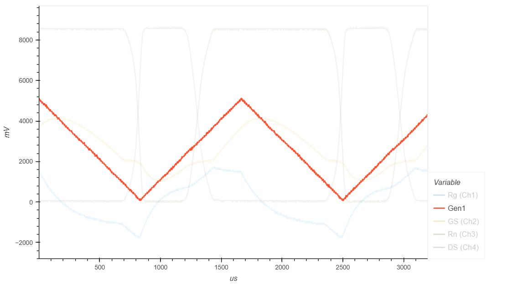

.. _rst_electronics_mosfet_mosfet:

Изучение свойств полевого транзистора
=====================================

.. note::
    На основе курса `Электроника для начинающих, Д.Забарило`_

    - 22.1. Полевые транзисторы
    - 22.2 Полевые транзисторы с изолированным затвором
    - 22.3 Основные параметры и проверка работы MOSFET
    - 22.4 Исследование работы MOSFET в режиме ключа

Задачи
------

#. Построить графики зависимости тока и напряжения на переходе Сток-Исток от тока и напряжения на переходе Затвор-Исток.
#. Проверить заявленное значение напряжения открытия выбранного полевого транзистора.

Введение
--------

Типы полевых транзисторов:

- с "p-n" переходом
    - в исходном состоянии открыт
    - поддерживает режим обеднения (для закрытия нужно приложить напряжение на Затвор-Исток)

- с изолированным затвором с встроенным каналом
    - в исходном состоянии открыт
    - поддерживает режим обогащения (чтобы открыть больше нужно приложить напряжение на Затвор-Исток)
    - поддерживает режим обеднения (для закрытия нужно приложить напряжение на Затвор-Исток)

- с изолированным затвором с индуцированным каналом
    - в исходном состоянии закрыт
    - поддерживает режим обогащения (для открытия нужно приложить напряжение на Затвор-Исток)

.. note::
    Полевой транзистор с изолированным затвором называют:

    - MOSFET - Metall-Oxide-Semiconductor-Field Effect Transistor
    - МОП - Металл-Окисл-Полупроводник
    - МДП - Металл-Диэлектрик-Полупроводник

В данной работе будет рассматриваться **Полевой транзистор с изолированным затвором с индуцированным каналом**.

МДП с индуцированным каналом
----------------------------

В исходном состоянии полевые транзистор с изолированным затвором с индуцированным каналом закрыт.
Канал индуцируется только в момент подачи НАПРЯЖЕНИЯ на Затвор-Исток.

.. important::
    Управление транзисторы с изолированным затвором с индуцированным каналом осуществляется **НАПРЯЖЕНИЕМ!!!**

Полевые транзисторы с изолированным затвором с индуцированным каналом
обладают высоким входным сопротивлением на участке Затвор-Исток.
Управляющий ток, практически, равен нулю.
Для управления требуется минимальная мощность, в отличии от биполярных транзисторов,
где ток База-Эмиттер ненулевой.

Полевые транзисторы с изолированным затвором с индуцированным каналом "n-p-n" типа с n-каналом:

- Исток / Source (-)
- Затвор / Gate (+) (управляющее напряжение)
- Сток / Drain (+)

.. code-block::

              │ С/D (+)
    З/G   ┌───┘
     +  │ │
     ───┤ ◄─┐
        │ │ │
          └─┴─┐
              │ И/S (-)

Ниже приведена физическая структура Полевого транзистора с изолированным затвором
с индуцированным каналом "n-p-n" типа с n-каналом.

.. code-block::

               │И/S    │З/G    │С/D
               │(-)    │(+)    │(+)
      ┌────────┤       │       │
      │        │       │       │
      │  ┌─────┼───────┴───────┼─────┐
      │  │     │   Диэлектрик  │     │
      │  ├───┬─┴─┬───────────┬─┴─┬───┤
      │  │   │ n │ (-)(-)(-) │ n │   │
      │  │   └───┘           └───┘   │
      │  │                           │
      │  │                           │
      │  │ p                         │
      │  └─────────────┬─────────────┘
      │                │ Подложка
      └────────────────┘ (-)

Если подать на Затвор (+), а на Подложку (-), то электроны притянутся к Затвору
и создадут n-канал, через который сможет протекать ток.

.. note::
	Исток-Подложка-Сток образуют паразитный биполярный транзистор.
	Чтобы от него избавиться, Подложку и Исток "закорачивают".

.. note::
	Исток-Сток образуют паразитный диод.
	Т.е., если подать (+) на Подложку/Исток и (-) на Сток, то через p-n переход потечет ток.

.. note::
    Затвор-Исток - это, фактически, емкость. Пластина Затвора, диэлектрик и пластина Подложки образуют емкость.
    На этой емкости скапливается заряд.
    Если убрать напряжение с Затвора, заряд останется и n-канал будет существовать до тех пор,
    пока эта емкость не разрядится. Транзистор будет открыт даже после снятия напряжения.
    Паразитный конденсатор существует и на переходе Затвор-Сток, но значительно меньшей емкости.

Примеры полевых транзисторов с изолированным затвором и индуцированным каналом:

- Полевой транзистор с изолированным затвором и индуцированным каналом n-p-n типа с n-каналом: IRF540
- Полевой транзистор с изолированным затвором и индуцированным каналом p-n-p типа с p-каналом: IRF9540

Основные параметры МДП транзисторов:

- **UDS** - максимальное напряжение Сток-Исток
- **UGS** - максимальное напряжение Затвор-Исток
- **UGS(th)** - минимальное напряжение Затвор-Исток, необходимое для открытия транзистора.
- **ID** - максимальный ток Стока.
- **RDS** - сопротивление Сток-Исток в открытом состоянии.

Простейшая схема подключения МДП транзистора для работы в качестве ключа.

.. code-block::

                              ┌─────────┐
                              │         │
                            ┌─┴─┐       │
                            │   │ Rn    │
                            │   │       │
                            └─┬─┘       │
                              │         │
            Rg            ┌───┘ С     + │  Un
         ┌─────┐      З │ │          ───┴───
       ┌─┤     ├─┬──────┤ ◄─┐          ─┬─
       │ └─────┘ │      │ │ │           │
     + │ Uупр  ┌─┴─┐      └─┴─┐ И       │
    ───┴───    │   │ R1       │         │
      ─┬─      │   │          │         │
       │       └─┬─┘          │         │
       │         │            │         │
       └─────────┴────────────┴─────────┘

- **R1** - Подтягивающий резистор R1 (10 КОм) нужен для защиты от ложных срабатываний.
  Для разряда паразитной емкости Затвор-Исток.
  В противном случае транзистор не будет закрываться.

- **Rg** - Защитное сопротивление служит для ограничения тока заряда паразитной емкости Затвор-Исток
  в момент открытия транзистора и на случай пробоя перехода Затвор-Исток транзистора,
  чтобы избежать короткого замыкания. Для обычного подключения достаточно 100 Ом.
  Если Затвор подключается напрямую к микроконтроллеру с разрешенным током 20 мА и напряжением 3.3 В,
  то сопротивление должно быть не менее 200 Ом.

Описание опыта
--------------

Принципиальная схема цепи, используемой в данной работе, изображена на рисунке ниже.

.. code-block::

                                              ┌────────┬──────┐
                                              │        │ +    │
                                            ┌─┴─┐Rn ┌──┴─┐    │
                                            │   │   │ Ch3│    │
                         +┌────┐            │   │   └──┬─┘    │
                       ┌──┤ Ch1├──┐         └─┬─┘      │      │
                       │  └────┘  │           ├────────┤      │
                       │     Rg   │ З/G   ┌───┘ С/D(+) │    + │  Un
                       │  ┌─────┐ │ (+) │ │            │   ───┴───
         ┌─────────────┴──┤     ├─┴─┬───┤ ◄─┐   VT1    │     ─┬─
         │                └─────┘   │   │ │ │          │      │
     ┌───┴───┐                      │     └─┴─┐        │ +    │
     │ Gen1  │                    ┌─┴──┐      │ И/S ┌──┴─┐    │
     └───┬───┘                    │ Ch2│      │     │ Ch4│    │
         │                        └─┬──┘      │     └──┬─┘    │
         │                          │         │        │      │
         └──────────────────────────┴─────────┴────────┴──────┘

.. note::
    Подтягивающий резистор R1 в данной схеме не нужен, т.к. нет висящего провода.

- **VT1** - IRL3705N (Полевой транзистор с изолированным затвором с индуцированным каналом "n-p-n" типа
  с N-каналом в корпусе TO-220)

    - **VDS** - 55 В
    - **ID** - 89 A
    - **VGS(th)** - 1-2 В

- **Rg** - 100 КОм (такое большое сопротивление выбрано для увеличения
  времени заряда паразитной емкости Затвор-Исток, для наблюдения за переходным процессом при открытии транзистора)

- **Rn** - 1 КОм
- **Un** - 8.5 В
- **Cзи** - 1.5 нФ (измеренное значение паразитной емкости на переходе Затвор-Исток)
- **Gen1** - 0 В - 5 В (треугольник / импульсы)

Расчет частоты генератора, при которой можно будет наблюдать переходные процессы.

#. Найдем время Tau для паразитной емкости на переходе Затвор-Исток

    .. math::
        Tau = Rg * Cзи = 100 000 * 1.5/10^9 = 0.00015 сек = 0.15 мс

#. Через интервал времени, равный 5 Тау, происходит (почти) полный заряд конденсатора.

    .. math::
        5Tau = Tau * 5 = 0.00015 * 5 = 0.00075 сек = 0.75 мс

#. Найдем частоту генератора, при которой паразитная емкость Затвор-Исток будет полностью заряжаться за полупериод

    .. math::
        F = 1/(2*5Tau) = 1/(2*0.00075) = 666.666... Гц

Для проведения опыта возьмем частоту немного меньше частоты, необходимой
для полного заряда паразитной емкости Затвор-Исток, чтобы емкость успевала полностью зарядиться с запасом времени.

- Для прямоугольных импульсов будем использовать частоту 500 Гц.
- Для треугольного сигнала будем использовать частоту 600 Гц.

Ожидаемый результат
-------------------

#. Переход Сток-Исток должен открываться при напряжении на переходе Затвор-Исток 2 В.

#. В момент открытия транзистора, ток на переходе Затвор-Исток при выбранном сопротивлении Rg (100 КОм)
   может достигать 0.05 мА за счет заряда конденсатора (I = U/R = 5/100000 = 0.05 мА)

Лабораторная работа
-------------------

Управление прямоугольными импульсами
^^^^^^^^^^^^^^^^^^^^^^^^^^^^^^^^^^^^

С генератора (Gen1) подаются прямоугольные импульсы.

- Частота: 500 Гц
- Амплитуда: 0 В - 0.5 В

   Сигнал генератора Gen1

На следующем графике представлена зависимость падения напряжения на переходе Сток-Исток (осциллограф Ch4)
от падения напряжения на переходе Затвор-Исток (осциллограф Ch2).

   Падение напряжения на переходе Затвор-Исток (осц. Ch2) и Сток-Исток (осц. Ch4)

В период времени, когда падение напряжения на переходе Затвор-Исток менее 1.7 В,
падение напряжения на переходе Сток-Исток равно напряжению источника питания 8.5 В.
Переход Сток-Исток закрыт и имеет очень большое сопротивление.

Но при достижении падения напряжения на переходе Затвор-Исток значения 1.7 В, переход Сток-Исток начинает открываться
и падает практически до нуля. Когда напряжение на переходе Затвор-Исток достигает 2 В,
переход Сток-Исток полностью открывается и его сопротивление становится близко к нулю.

.. note::
    На графике падения напряжения на переходе Затвор-Исток можно наблюдать "Эффект Миллера".
    Падение напряжения замедляется в момент открытия перехода Затвор-Исток.

В то же время, падение напряжения на нагрузке (Rn) изменялось обратно пропорционально падению напряжения
на переходе Сток-Исток.

   Падение напряжения на нагрузке (Rn) (осц. Ch3)

На следующем графике показано падение напряжения на защитном сопротивлении перехода Затвор-Исток (Rg).
Для наглядности оно показано с графиками генератора и падения напряжения на переходе Затвор-Исток.

   Падение напряжения на защитном сопротивлении перехода Затвор-Исток (Rg) (осц. Ch1)

Начнем рассматривать процесс с момента, когда напряжение генератора равно нулю.
Паразитная емкость перехода Затвор-Исток разряжена и имеет бесконечно большое сопротивление.
Падения напряжения на защитном сопротивлении Rg нет.

С генератора поступает импульс. В первый момент времени сопротивление перехода Затвор-Исток близко к нулю.
Все напряжение падает на защитном сопротивлении Rg.
Паразитная емкость перехода Затвор-Исток начинает заряжаться.
Сопротивление перехода Затвор-Исток увеличивается и становится бесконечно большим.
Все напряжение падает на переходе Затвор-Исток.

Напряжение генератора становится равно нулю.
Паразитная емкость перехода Затвор-Исток начинает разряжаться.
Ток разряда паразитной емкости Затвор-Исток начинает течь от Затвора к генератору.
Падение напряжения на защитном сопротивлении перехода Затвор-Исток (Rg) отрицательное.
После полного разряда паразитной емкости Затвор-Исток ток в цепи генератора перестает течь.
Падение напряжения на защитном сопротивлении (Rg) и на переходе Затвор-Исток равно нулю.

На следующем графике показаны зависимости падения напряжения на защитном сопротивлении перехода Затвор-Исток (Rg)
и на переходе Затвор-Исток при наличии напряжения нагрузки и без напряжения нагрузки.
Когда напряжение нагрузки отсутствует, падение напряжения изменяется плавно из-за отсутствия "Эффекта Миллера".

   Падения напряжения на Rg и на переходе Затвор-Исток при наличии и отсутствии напряжения нагрузки

- :download:`Интерактивный график в формате html <docs/VER2(Square_500Hz)/ec_009_MOSFET(VER2).html>`
- :download:`Измерения в формате csv <docs/VER2(Square_500Hz)/result.csv>`

Треугольный управляющий сигнал
^^^^^^^^^^^^^^^^^^^^^^^^^^^^^^

С генератора (Gen1) подается треугольный сигнал.

- Частота: 600 Гц
- Амплитуда: 0 В - 0.5 В

   Сигнал генератора Gen1

На следующем графике представлена зависимость падения напряжения на переходе Сток-Исток (осциллограф Ch4)
от падения напряжения на переходе Затвор-Исток (осциллограф Ch2).

   Падения напряжения на переходе Затвор-Исток (осц. Ch2) и Сток-Исток (осц. Ch4)

В период времени, когда падение напряжения на переходе Затвор-Исток менее 1.7 В,
падение напряжения на переходе Сток-Исток равно напряжению источника питания 8.5 В.
Т.е. переход Сток-Исток закрыт и имеет очень большое сопротивление.

Но при достижении падения напряжения на переходе Затвор-Исток значения 1.7 В, переход Сток-Исток начинает открываться
и падает практически до нуля. Когда напряжение на переходе Затвор-Исток достигает 2В
переход Сток-Исток полностью открывается и его сопротивление становится близко к нулю.

.. note::
    На графике падения напряжения на переходе Затвор-Исток можно наблюдать "Эффект Миллера".
    Падение напряжения замедляется в момент открытия перехода Затвор-Исток.

В то же время, падение напряжения на нагрузке (Rn) изменялось обратно пропорционально напряжению
на переходе Сток-Исток.

   Падение напряжения на нагрузке (Rn) (осц. Ch3)

На следующем графике показано падение напряжения на защитном сопротивлении перехода Затвор-Исток (Rg).
Для наглядности оно показано с графиками генератора и падения напряжения на переходе Затвор-Исток.

   Падение напряжения на защитном сопротивлении перехода Затвор-Исток (Rg) (осц. Ch1)

В момент времени, когда напряжение генератора равно нулю и начинает возрастать, паразитная емкость
перехода Затвор-Исток со стороны Затвора имеет потенциал выше нуля.
На графике падения напряжения на переходе Затвор-Исток видно, что напряжение в этот момент около 2 В.

Поэтому ток течет от Затвора к генератору и падение напряжения
на сопротивлении перехода Затвор-Исток (Rg) отрицательное.

Когда напряжение генератора и напряжение Затвора выравниваются, ток начинает течь от генератора к Затвору,
паразитная емкость перехода Затвор-Исток начинает заряжаться
и падение напряжения на переходе Затвор-Исток начинает возрастать.

На следующем графике показаны зависимости падения напряжения на защитном сопротивлении перехода Затвор-Исток (Rg)
и на переходе Затвор-Исток при наличии напряжения нагрузки и без напряжения нагрузки.
Когда напряжение нагрузки отсутствует, падение напряжения изменяется плавно из-за отсутствия "Эффекта Миллера".

   Падение напряжения на Rg и на переходе Затвор-Исток при наличии и отсутствии напряжения нагрузки

- :download:`Интерактивный график в формате html <docs/VER1(Triangle_600Hz)/ec_009_MOSFET(VER1).html>`
- :download:`Измерения в формате csv <docs/VER1(Triangle_600Hz)/result.csv>`

Выводы
------

#. При достижении на переходе Затвор-Исток напряжения открытия (1.7 В),
   переход Сток-Исток начинает открываться, даже если паразитная емкость не полностью заряжена.
   Т.е. n-канал и паразитная емкость существуют независимо друг от друга.
   Паразитная емкость лишь может замедлить время, за которое достигается напряжение открытия.
   И затем паразитная емкость может поддерживать напряжение открытия даже без приложения внешнего напряжения.

#. Если к переходу Сток-Исток приложено напряжение, то во время перехода Сток-Исток
   из закрытого состояния в открытое (и наоборот) заряд (разряд) паразитной емкости замедляется
   и на графике наблюдается "Эффект Миллера" (плато), в отличие от графика,
   когда на переходе Сток-Исток нет напряжения.

#. Изменение перехода Сток-Исток из закрытого состоя в открытое (и наоборот) происходит не мгновенно,
   а на диапазоне напряжения на переходе Затвор-Исток, примерно 1.7 В - 2 В.
   На этом диапазоне напряжения транзистор работает, в усилительном режиме.
   Чем дольше происходит переход через диапазон 1.7В - 2В,
   тем больше мощности теряется на сопротивлении Сток-Исток.

#. Защитное сопротивление Rg увеличивает время заряда паразитного конденсатора,
   Поэтому, оно не должно быть слишком большим.
   В эксперименте с прямоугольными импульсами время полного открытия перехода Сток-Исток составило 140 мкСек.
   В то же время, если Rg будет слишком маленьким, то через него будет протекать большой ток в момент открытия.
   Например, при Rg=100 Ом и управляющем напряжении Затвор-Исток 5 В.,
   ток в момент подачи управляющего напряжения будет 0.05 А (I = U/R = 5/100 = 0.05 А),
   что составит 0.25 Вт (P = I*U = 0.05*5 = 0.25 Вт), а это предел для SMD резистора типоразмером 1206.
   Сопротивление Rg должно быть значительно меньше чем притягивающее сопротивление R1,
   чтобы обеспечить необходимое падение напряжения на переходе Затвор-Исток.

Вопросы
-------

1. Какое должно быть оптимальное сопротивление Rg для того,
   чтобы уменьшить потери мощности во время открытия перехода Сток-Исток?

2. Если в диапазоне открытия перехода Сток-Исток (1.7 В - 2 В) транзистор работает в режиме усиления,
   то через переход Затвор-Исток должен протекать ток.
   Если подать постоянное напряжение в диапазоне 1.7 В - 2 В на переход Затвор-Исток,
   будет ли через него протекать постоянный ток (с учетом того, что там диэлектрик)?

3. Согласно расчетам, сопротивление на переходе Сток-Исток в закрытом состоянии порядка 100 КОм.
   Но, согласно теории, сопротивление должно быть 10^12 - 10^14 Ом. Если поставить Rn 100 КОм,
   будет ли одинаковое падение напряжения на переходе Сток-Исток и на Rn?
   Т.е. действительно ли сопротивление Сток-Исток в закрытом состоянии 100 КОм или это погрешность расчетов?

Ссылки
------

#. `Электроника для начинающих, Д.Забарило`_
#. `Драйвер для MOSFET и IGBT | Принцип выбора и расчет. Часть 1`_
#. `Драйвер для MOSFET и IGBT | Принцип выбора и расчет. Часть 2`_
#. `Драйвер для MOSFET и IGBT | Принцип выбора и расчет. Часть 3`_
#. `ШИМ + MOSFET + ДРАЙВЕР | Принцип работы на практике #4`_
#. `Транзисторный ключ от А до Я. Практика и теория. Полевые MOSFET и биполярные транзисторы`_

.. _Электроника для начинающих, Д.Забарило: https://diodov.net/elektronika-dlya-nachinayushhih/
.. _Драйвер для MOSFET и IGBT | Принцип выбора и расчет. Часть 1: https://www.youtube.com/watch?v=csssorFuDTU
.. _Драйвер для MOSFET и IGBT | Принцип выбора и расчет. Часть 2: https://www.youtube.com/watch?v=vPpQLqj80oo
.. _Драйвер для MOSFET и IGBT | Принцип выбора и расчет. Часть 3: https://www.youtube.com/watch?v=RtZGEq4D90U
.. _ШИМ + MOSFET + ДРАЙВЕР | Принцип работы на практике #4: https://www.youtube.com/watch?v=IrzRy8A-hLM
.. _Транзисторный ключ от А до Я. Практика и теория. Полевые MOSFET и биполярные транзисторы: https://www.youtube.com/watch?v=e4qjSnRAO5s
