.. _rst_equipment_hantek6254bd_hantek6254bd:

Осциллограф Hantek 6254BD
=========================

Hantek 6254BD (серия 6004BD).

"4CH oscilloscope & function/Arb. waveform generator.
The performance of this model could even better than the performance of benchtop oscilloscope.
It has 4 independent analog channels, 1GSa/s real-time sampling rate,
2mV-10V/DIV input sensitivity, 250MHz bandwidth and Arbitrary Waveform Generator.
It is powered by USB2.0 Interface, plug and play device with small size which is easy for carrying.
High cost performance, pass/fail test, resourceful trigger function,
dynamic cursor tracking, waveform record and replay function."

(https://hantek.com/products/detail/10164)

Max Bandwidth:

- One Channel: 250MHz
- Two Channels: 200MHz
- Three Channels: 100MHz
- Four Channels: 70MHz

- Input Impedance: 1МОм
- Input Sensitivity: 2mV/div to 10V/div

-- "Hantek 6000B(C,D,E)_Manual_English(V1.0.0)"

Установка и настройка
---------------------

#. Скачать ПО с официального сайта `Hantek`_. В разделе "Download" (https://hantek.com/download)
   выбрать "Application software" и выбрать "Hantek-6000BD Software".
   Актуальная версия на 19.12.2025 - Ver.2.2.7 от 2022-05-17.
   User Manual находится в ``.\Hantek-6000_Ver2.2.7_D20220325\Manual\``

#. Установить ПО. По умолчанию софт устаравливается в папку ``c:\Program Files (x86)\Hantek6000``

#. Установить драйвер для осциллографа.
   Для этого подключить осциллограф к USB порту компьютера.
   В Диспетчере устройств найти неопознанное оборудование.
   Обновить драйвер, указав папку ``c:\Program Files (x86)\Hantek6000\Driver\Win10\``

#. Выполнить калибровку каналов.
   Для этого отключить все пробники от входов осциллографа и выполнить: "Utility" -> "Calibration"

#. Установить делитель напряжения "х10" на щупах и в настройках "Vertical".

Постоянный захват сигнала
-------------------------

Сигнал генератора
^^^^^^^^^^^^^^^^^

В качестве источника сигнала используется встроенный генератор.
На рисунке ниже показаны настройки сигнала генератора.

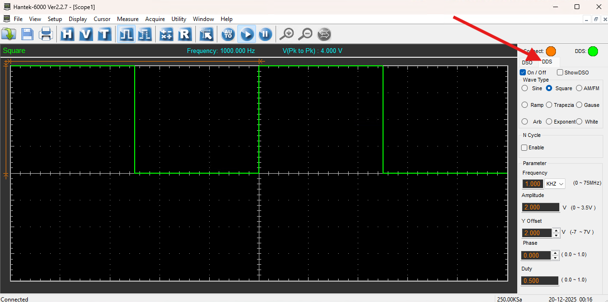

   Настройки сигнала встроенного генератора

- **Wave Type** - Square
- **Frequency** - 1 kHz
- **Y Offset** - 2В (т.е присутствует постоянная составляющая 2В)

С данными настройками генератор выдает прямоугольные импулься частотой 1 кГц в диапазоне 0...2В.

Настройка каналов
^^^^^^^^^^^^^^^^^

Настройки каналов осциллографа.

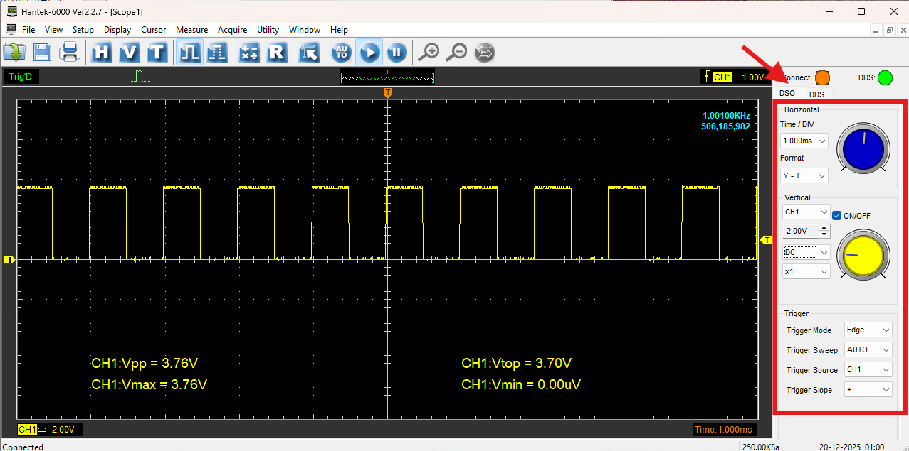

   Настройки каналов осциллографа

**Блок настроек "Horizontal"**

Настройки "Horizontal" отображаются в правом нижнем углу экрана осциллографа.

- **Time / DIV** - цена большого деления по горизонтали. В данном примере установлена 1 миллисекунда.

**Блок настроек "Vertical"**

В данном блоке настроек выполняется включение / выключение каналов и настройка каналов.
Настройки "Vertical" отображаются в левом нижнем углу экрана осциллографа.

- **CH1** - В данном примере выбран первый канал (CH1). Остальные каналы выключены.

- **2.00V** - Цена деления большого квадрата 2В.
  Чем меньше каналов включено, тем больше частота захвата и тем больше буфер хранения сигнала можно использовать.

- **DC** - Выбран синглал с постоянной составляющей

    - **AC** - постоянная составляющая отфильтровывается
    - **DC** - постоянная составляющая сохраняется

- **x1** - В данном случае исиользуется кабель без делителя напряжения.
  В случае, если на щупе установлено деление напряжение x10, нужно выбрать это же значение в данных настройках.

**Блок настроек "Trigger"**

Настройки "Trigger" отображаются в правом верхнем углу экрана.
Уровен напряжения задается бегунком на вертикально оси справа.
Цвет бегунка соответствует цвету канала триггера.
Момент срабатывания триггера задается бегунком на верхней горизонтальной оси.

- **Trigger Mode** - устанавливается способ срабатывания триггера. В данном случае выбрано значение "Edge",
  т.е. срабатывание по фронту сигнала.

- **Trigger Sweep** - тип захвата сигнала.

    - **AUTO** - захват данных происходит постоянно.
      Установленный момент триггера используется для синхронизации сингала.
    - **NORMAL** - захват начинается, когда срабатывает триггер
      и останавливается после заполнения буфера. Если после остановки записи
      опять сработает триггер, то запись повторится снова.
    - **SINGLE** - захват начинается, когда срабатывает триггер
      и останавливается после заполнения экрана.

- **Trigger Source** - по какому каналу срабатывает триггер.

- **Trigger Slope** - по какому фронту срабатывает триггер.

    - **"+"** - по переднему фронту
    - **"-"** - по заднему фронту

**Настройки измерений**

Настройки отображаемых на экране осциллографа измерений выполняются в меню "Measure" -> "Edit Options".

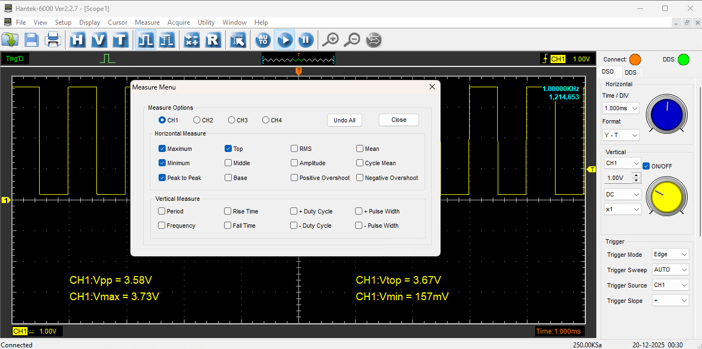

   Настройки измерений

**Настройка измерения частоты и счетчика срабатываний триггера**

В меню "Utility" -> "F/C" можно включить отображение частоты сигнала и счетчика срабатываний триггера.
С помощью меню "Reset Counter" можно сбросить счетчик срабатываний триггера.

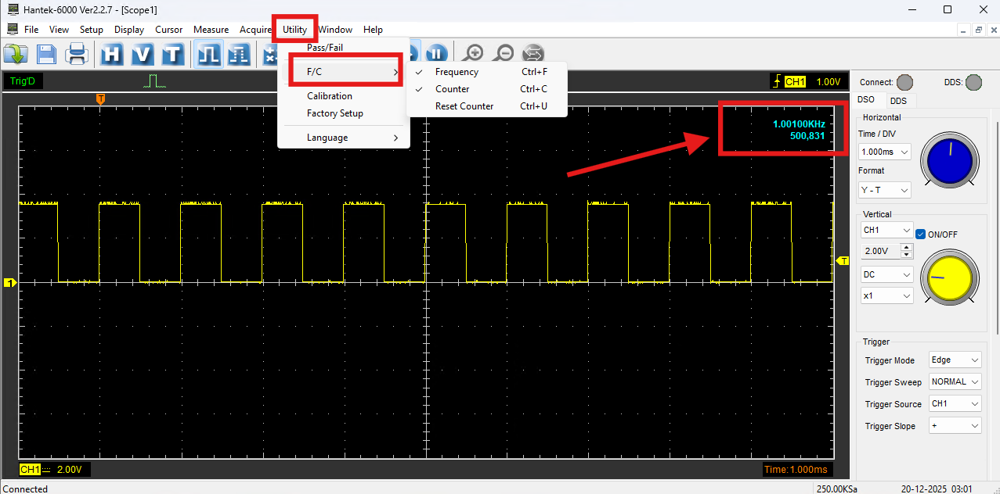

   Настройка измерения частоты и счетчика срабатываний триггера

**Настройки буфера**

Выбрать необходимый размер буфера.
Чем меньше каналов включено, тем больший буфер можно использовать.

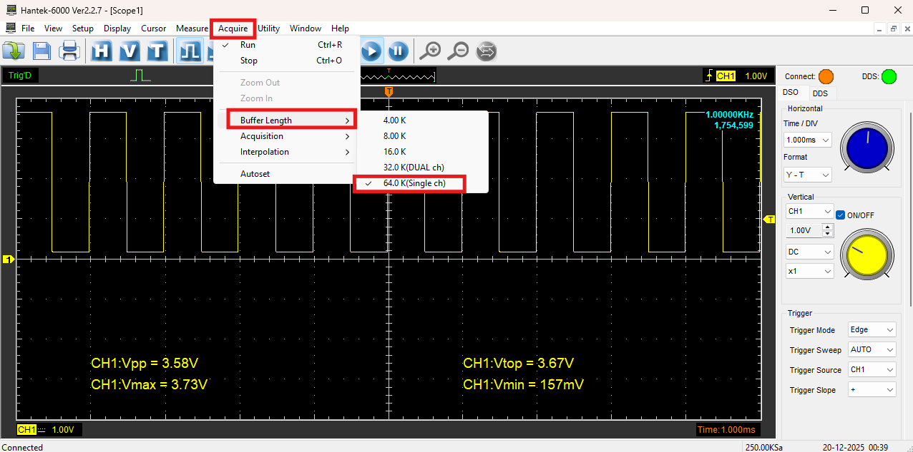

   Настройки буфера

.. note::
    Сделанные настройки можно сохранить в файл, чтобы не настраивать все снова при следующем включении.
    "File" -> "Save Setup". Для загрузки настрек из файла "File" -> "Load Setup".

Режим NORMAL
------------

В режиме NORMAL захват начинается при срабатывание триггера
и продолжается пока срабатывает триггер по входному сигналу.
Когда сигнал пропадает, запись останавливается.
Если после остановки записи опять поступает сигнал и срабатывает триггер,
то запись опять начинается. Старый сигнал, при этом, не сохраняется.

В режиме NORMAL можно остановить запись и возобновить ее кнопками "Start/Stop Collecting Data".

Пример, подаем на вход три импульса треугольной формы.

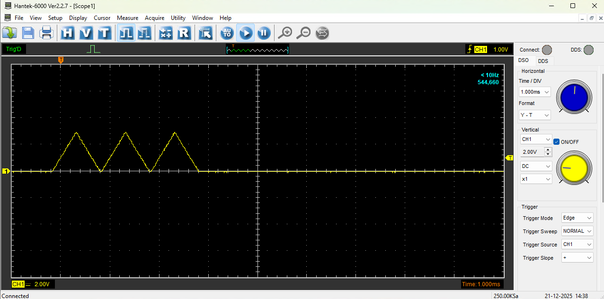

   Три импульса треугольной формы в режиме NORMAL

Затем, через какое-то время подали 7 импульсов треугольной формы.

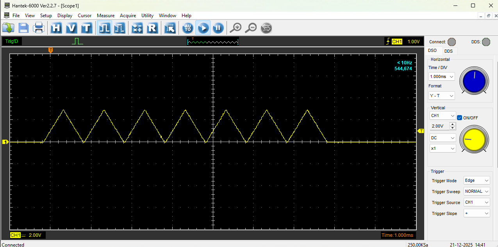

   Семь импульсов треугольной формы в режиме NORMAL

Прокрутка, почему-то, не работает.

Однократный захват сигнала
--------------------------

Для однократного захвата сигнала нужно:

#. Установить ``Trigger Sweep`` в значение **"SINGLE"**;
#. Установить горизонтальный бегунок вверху экрана на момент времени, где должен сработать тригер.
#. Установить вертикальный бегунок на уровень напряжения, при котором должен сработать триггер.

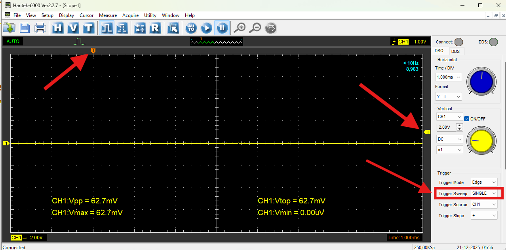

   Настройки однократного захвата сигнала

При поступлении сингала, он будет записан от момента срабатывания триггера до заполнения буфера.
Например, на вход было подано 25 импульсов.

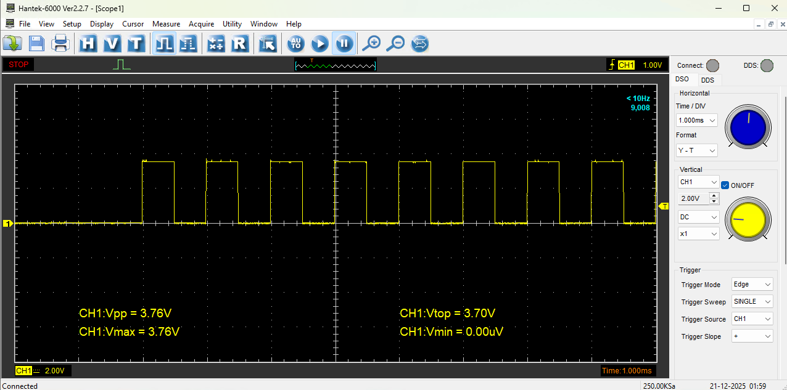

   Захваченный сигнал

Для прокрутки буфера использовать кнопки "+", "-" и стрелки прокрутки.
Либо, можно изменить цену деления "Time / DIV"

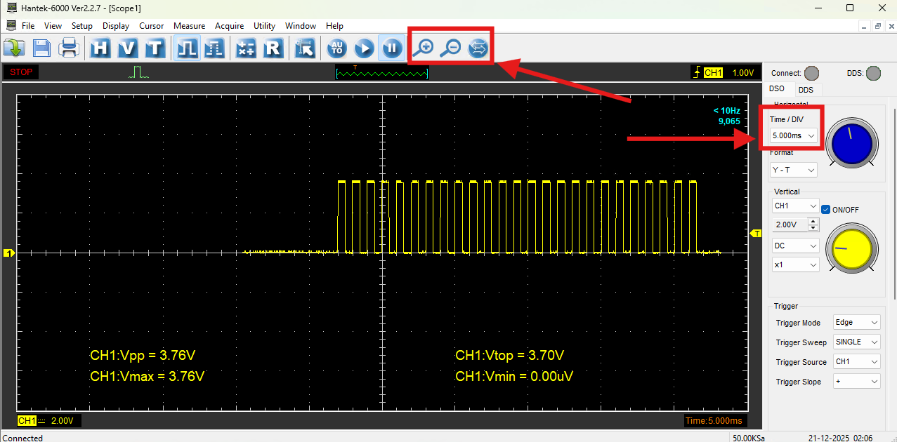

   Захваченный сигнал

Измерение сигнала
-----------------

Измерение сигнала выполняются с помощью курсора.

Перед измерением необходимо выбрать измеряемый канал.

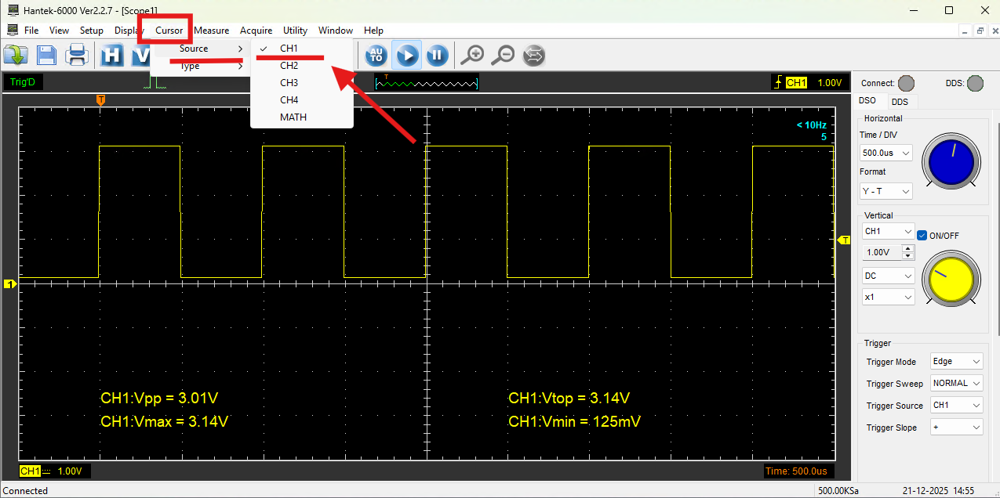

   Измеряемый канал

Выбрать тип измерения.

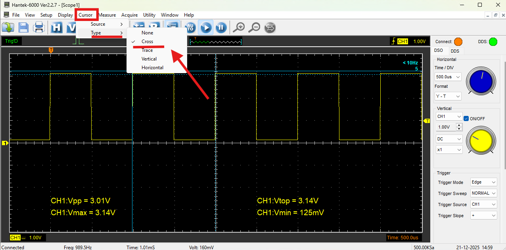

   Тип измерения

Результаты измерений отображаются в строке состояния.

**Измерение Cross**

C помощью этого типа измерения выполняется замер напряжения между двумя горизонтальными линиями
и замер интервала времени между двумя вертикальными линиями.

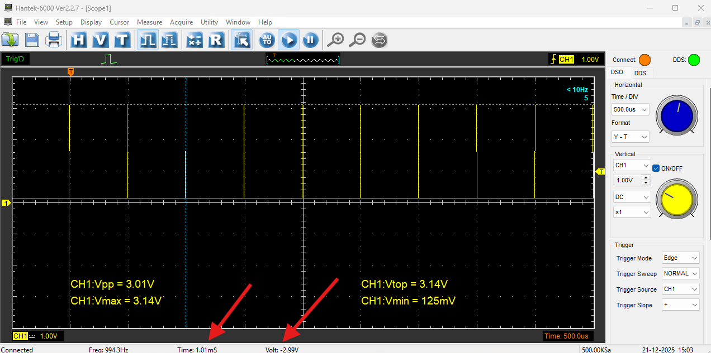

   Измерение Cross

**Измерение Trace**

C помощью этого типа измерения выполняется замер напряжения на пересечении вертикальной линии.

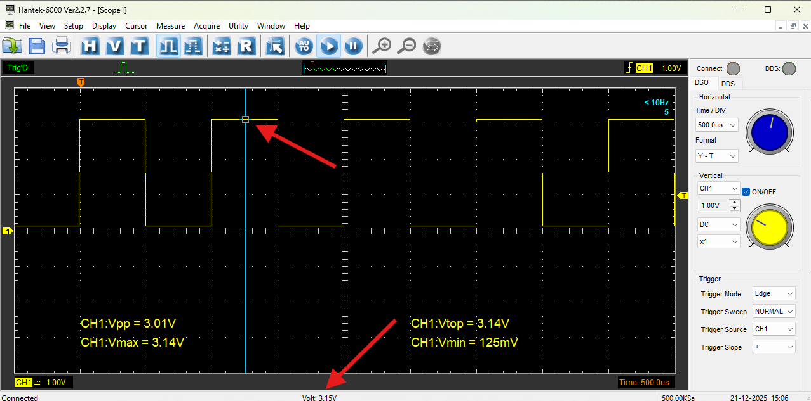

   Измерение Trace

**Измерение Vertical**

С помощью этого измерения выполняется замер интервала времени между двумя вертикальными линиями

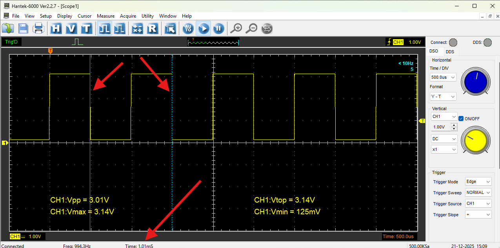

   Измерение Vertical

**Измерение Horizontal**

С помощью этого измерения выполняется замер напряжения между двумя горизонтальными линиями

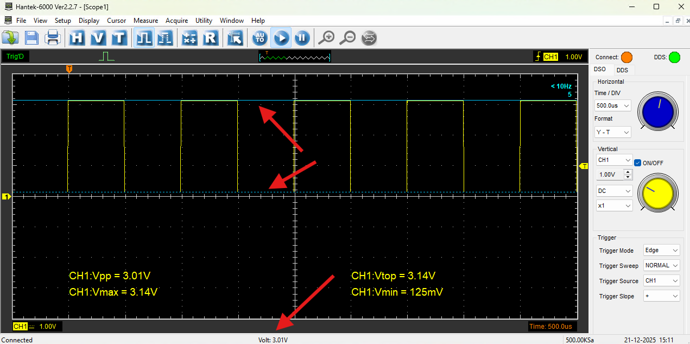

   Измерение Horizontal

Триггер
-------

Срабатывание триггера по фронту. Trigger Mode "Edge".

Для наглядности будем использовать режим захвата "SINGLE".
На вход подаются три треугольных импульса.

Для настройки типа захвата по возрастанию / убыванию сигнала нужно установить "Trigger Slope"
в значение "+" / "-" соответственно.

Пример захвата сигнала по переднему фронту:

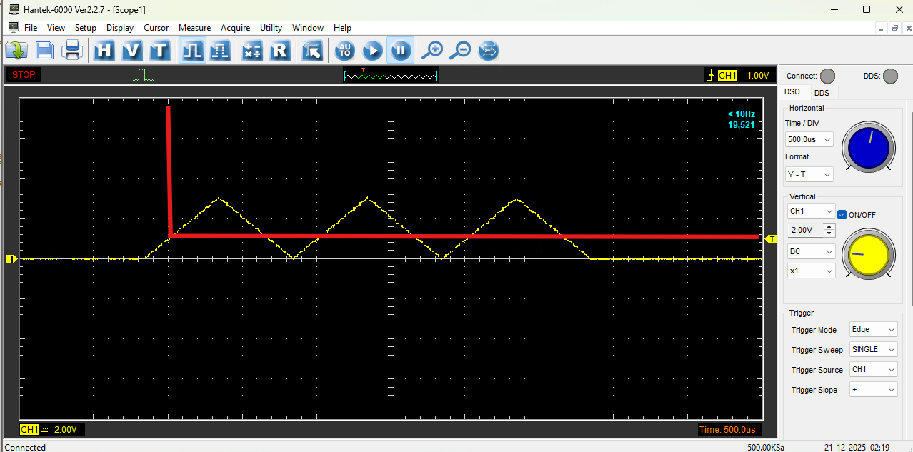

   Захваченный сигнал по переднему фронту

Пример захвата сигнала по заднему фронту:

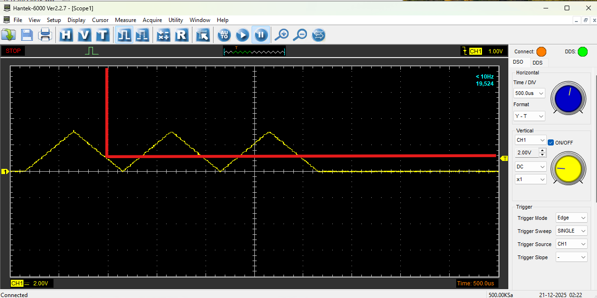

   Захваченный сигнал по заднему фронту

Сохранение сигнала в файл
-------------------------

Сохранение в файл выполняется с помощью меню "File" -> "Save Data".
Можно использовать сочетание клавиш "Ctrl + S"

Можно выбрать отдельный канал или все канала.
Сохранять лучше в txt формате.

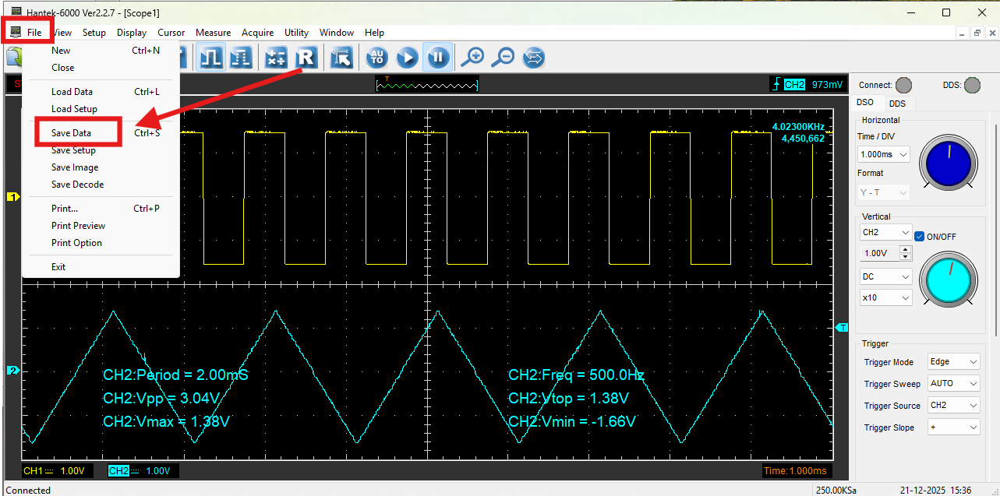

   Сохранение в файл

Ссылки
------

#. `Google`_

.. _Google: https://www.Google.com

#. `Hantek`_
#. "Hantek 6000B(C,D,E)_Manual_English(V1.0.0)"

.. _Hantek: https://hantek.com/
