.. _rst_equipment_utg962e_utg962e:

Генератор UTI-T UTG962E
=======================

Генератор UTI-T UTG962E (серия UTG900E).

- Максимальная частота 60 МГц с разрешением 1 микроГц
- Диапазон амплитуд 1мВ...10В
- Выходное сопротивление 50 Ом
- Два выходных канала
- Одни дополнительный выход для синхронизации

Документация доступна по ссылке `UTG900E Series`_

Установка и настройка
---------------------

Удаленное управление
^^^^^^^^^^^^^^^^^^^^

Управление может осущетвлятся с компьютера.

#. Скачать и установить ПО "Device Manager" с официального сайта `UTG900E Series Download Center`_.
   Актуальная версия на 03.01.2026 - Device Manager V2.8 2025/7/21.

#. Запустить "Device Manager" и подключить генератор к USB порту.

#. Выбрать "Open AWG" для запуска интерфейса удаленного управления

    .. figure:: images/utg962e_01_remote.png
       :width: 500px
       :align: center

       Device Manager

#. После чего запустится интерфейс удаленного управления

    .. figure:: images/utg962e_02_remote.png
       :align: center

       Интерфейс удаленного управления

Настройки параметров
^^^^^^^^^^^^^^^^^^^^

Для перехода в настрйки параметров каналов: "CH1" -> "Utility"

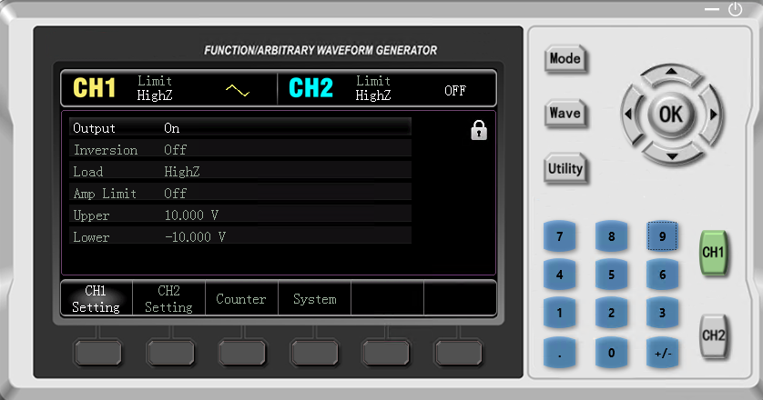

   Настрйки параметров каналов

- **Output** - Включен или выключен канал
- **Inversion** - Инверсия сигнала
- **Load** - Сопротивление нагрузки
- **Amp Limit** - Ограничение по амплитуде включено / выключено
- **Upper** - Верхнее ограничение по амплитуде (если включено)
- **Lower** - Нижнее ограничение по амплитуде (если включено)

Управление выходным сигналом
----------------------------

Выбор настраиваемого канала
^^^^^^^^^^^^^^^^^^^^^^^^^^^

Выбор настраиваемого канала осуществляется однократным нажатием кнопок "CH1" / "CH2".

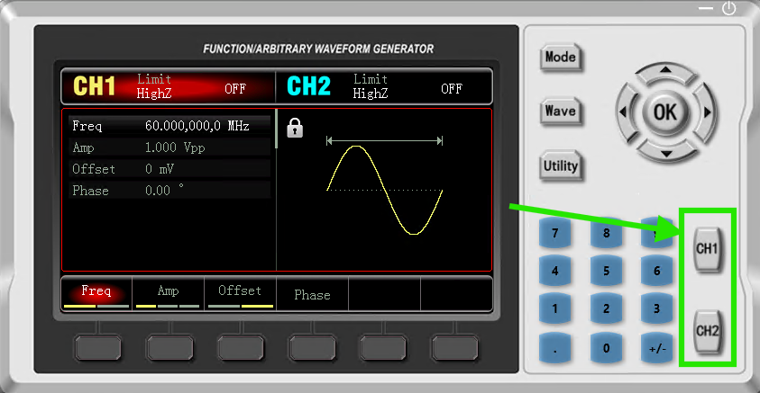

   Выбор настраиваемого канала

При повторном нажатии на кнопку "CH1" / "CH2" запускается генерация сигнала.

Выбор вида сигнала
^^^^^^^^^^^^^^^^^^

Выбор вида сигнала осуществляется нажатием кнопки "Wave" и далее кнопками под экраном.

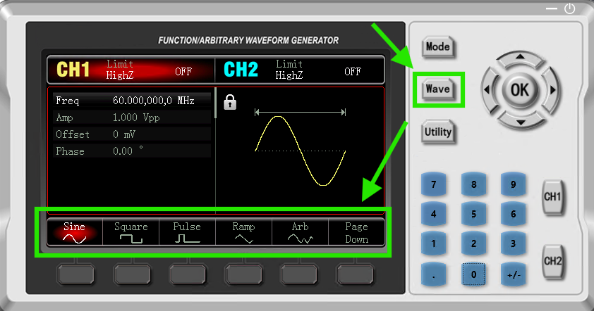

   Выбор вида сигнала

В данном примере выбран синусоидальный сигнал.

Настройки параметров сигнала
^^^^^^^^^^^^^^^^^^^^^^^^^^^^

На следующем экране выполняется настройка параметров сигнала.

Выбор параметров осуществляется с помощью кнопок под экраном или с помощью вращающейся ручки.
Значения параметров можно задавать с помощью цифровых клавиш или с помощью вращающейся ручки.

Все параметры наглядно поясняются стрелочками на экране с изображением сигнала.

Например, настроим на первом канале следующий синусоидальный сигнал:

- **Freq** - Частота сигнала 60 МГц
- **Amp** - Амплитуда сигнала 1 В
- **Offset** - Сдвиг относительно нуля 0 В
- **Phase** - Сдвиг фазы отсутствует.

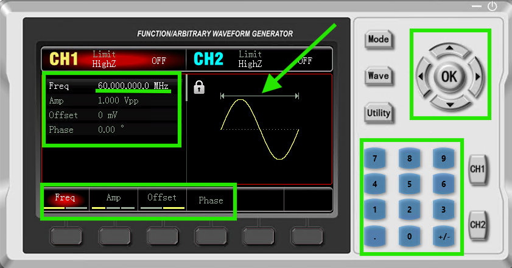

   Настройки параметров сигнала на первом канале

Настроим на втором канале следующий синусоидальный сигнал:

- **Freq** - Частота сигнала 60 МГц
- **Amp** - Амплитуда сигнала 1.5 В
- **Offset** - Сдвиг относительно нуля 0.5 В
- **Phase** - Сдвиг фазы  на 180 градусов.

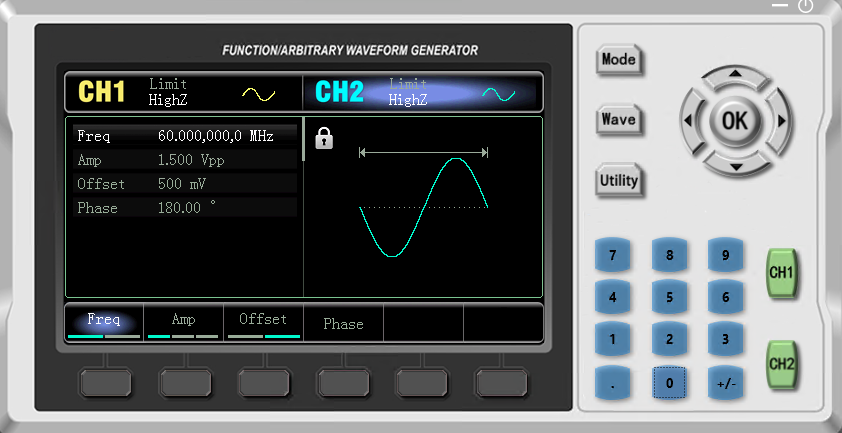

   Настройки параметров сигнала на втором канале

В результате получаем следующие сигналы:

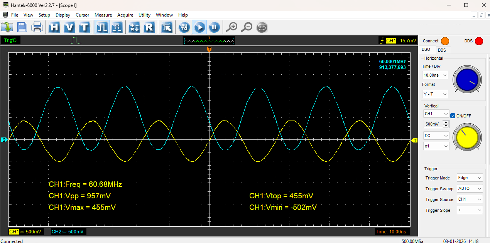

   Полученные сигналы на первом и втором каналах

Настройка модуляции
^^^^^^^^^^^^^^^^^^^

Можно сгенерировать сигнал с модуляцией.

Например, ниже показана конфигурация для синусоидального сигнала с амплитудной модуляцией с синусоидальной несущей.

Задаем параметры несущего сигнала.
В данном лсучае, это сигнал с частотой 3 МГц.

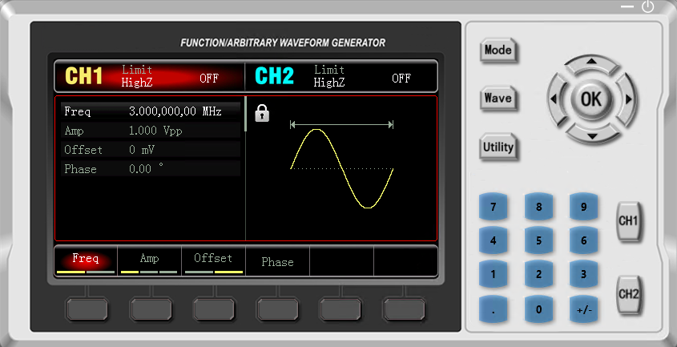

   Параметры несущего сигнала

Задаем параметры модулированного сигнала.
В данном лсучае, это сигнал с частотой 200 КГц и глубиной 100%.

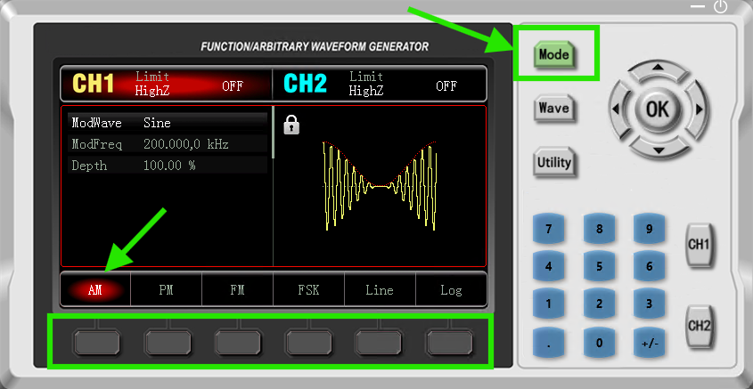

   Параметры модулированного сигнала

В результате получаем следующий сигнал:

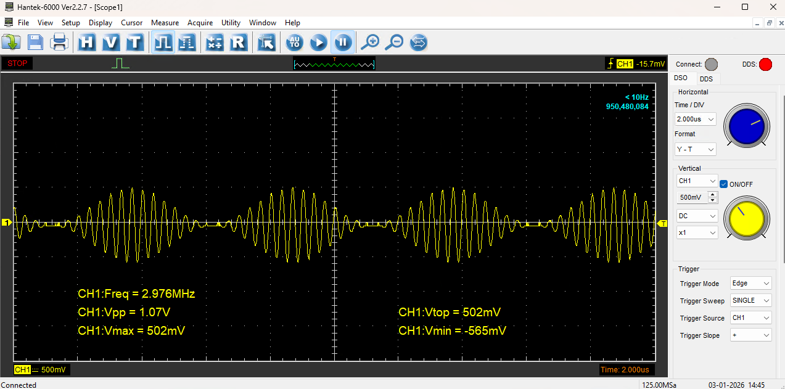

   Полученный сигнал

В следующем примере установили глубину 50%. Все остальные настройки те же.

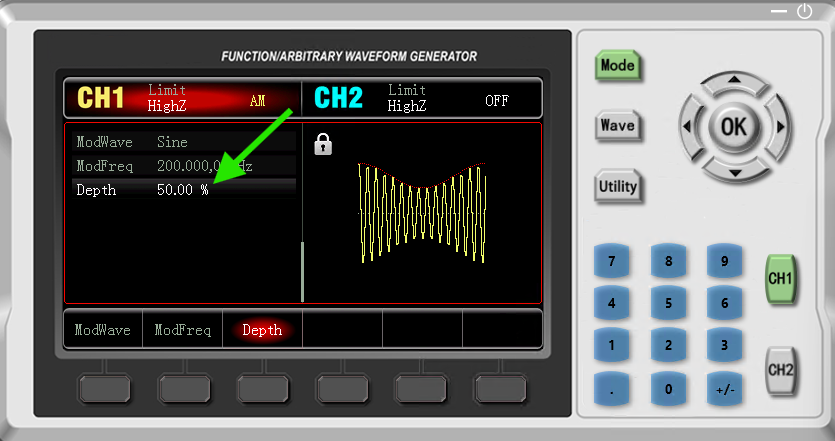

   Параметры модулированного сигнала

В результате получаем следующий сигнал:

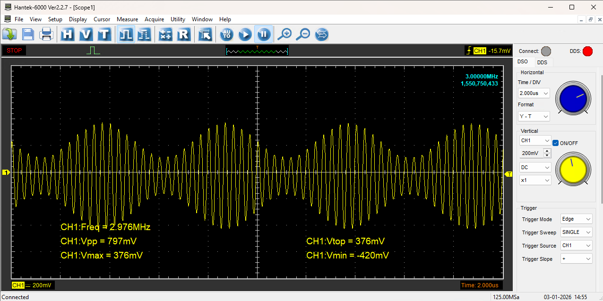

   Полученный сигнал

Можно выбирать любые типы модулированного и несущего сигнала.

В примере ниже несущий сигнал треугольник с частотой 400 КГц.

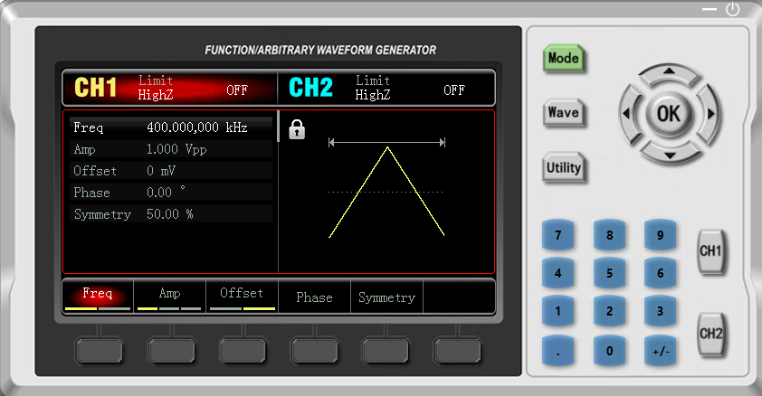

   Параметры несущего сигнала

Модулированный сигнала это импульсы с частотой 50 КГц и глубиной 70%.

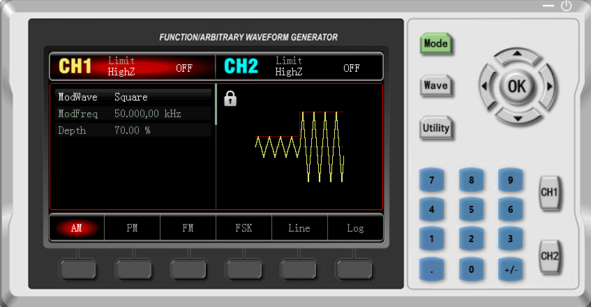

   Параметры модулированного сигнала

В результате получаем следующий сигнал:

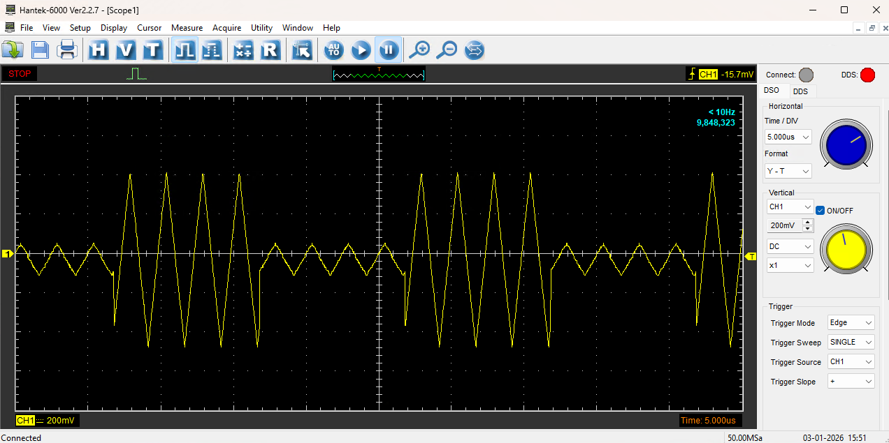

   Полученный сигнал

Измерение сигнала
-----------------

С помощью данного прибора можно измерять частоту, период и заполнение поданного на вход "FSK/CNT/Sync" сигнала.

Например, подаем на вход "FSK/CNT/Sync" следущий сигнал:

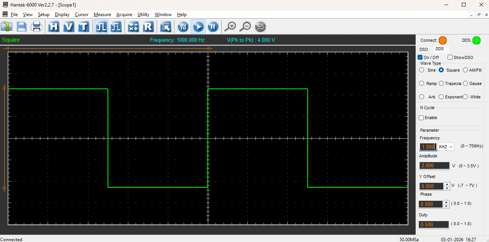

   Поданный сигнал

Переходим в меню "Utility" и выбираем "Counter"

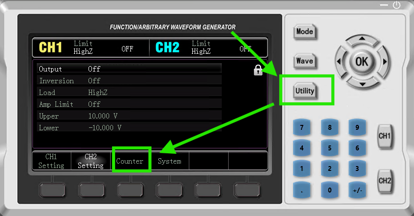

   Utility

На следующем экране будут показаны результаты измерения

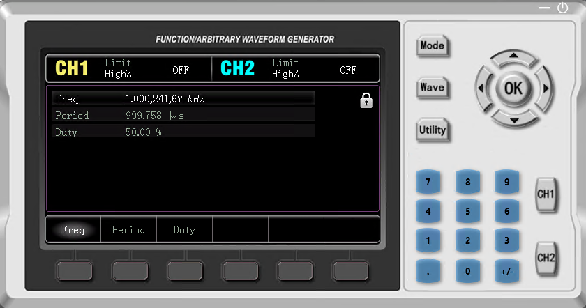

   Counter

Ссылки
------

#. `Google`_

.. _Google: https://www.Google.com

#. `UNI-T`_
#. `UTG900E Series`_
#. `UTG900E Series Download Center`_

.. _UTG900E Series Download Center: https://instruments.uni-trend.com/download?cate=22
.. _UTG900E Series: https://instruments.uni-trend.com/products/waveform-generators/UTG900E
.. _UNI-T: https://instruments.uni-trend.com/
