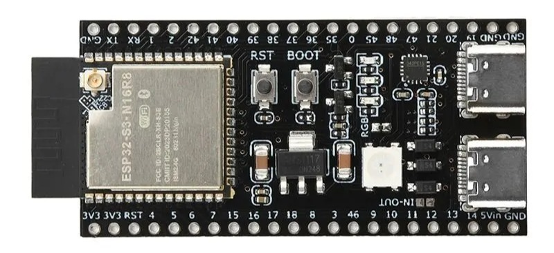

Quick start ESP32
=================

Для подключения к плате ESP нужно установить драйвер CH340G или CP210x для USB UART в зависимости от типа NodeMcu.

Ссылки для скачивания драйверов:

- `CH341SER, Nanjing Qinheng Microelectronics Co`_
- `CP210x, Silicon Labs`_

ESP32-S3 vs MicroPython
-----------------------

В данном примере используется плата **ESP32-S3-N16R8**

#. Install **esptool**

    .. code-block::

        pip install esptool

#. Download **MicroPython** Firmware

    | Download the ``.bin`` file from `MicroPython, ESP32-S3`_
    | For example: ``ESP32_GENERIC_S3-20260406-v1.28.0.bin``

#. Connect the board to PC via USB

    It was connected to the right port (near pin 19).
    Make sure the board is detected.

    .. figure:: images/com3.png
       :width: 350px
       :align: center

#. Erase flash

    .. code-block::

        esptool --chip esp32s3 --port COM3 erase_flash

    .. code-block::

        >esptool --chip esp32s3 --port COM3 erase_flash
        esptool.py v4.8.1
        Serial port COM3
        Connecting....
        Chip is ESP32-S3 (QFN56) (revision v0.2)
        Features: WiFi, BLE, Embedded PSRAM 8MB (AP_3v3)
        Crystal is 40MHz
        MAC: e8:3d:c1:f3:3a:9c
        Uploading stub...
        Running stub...
        Stub running...
        Erasing flash (this may take a while)...
        Chip erase completed successfully in 7.1s
        Hard resetting via RTS pin...

#. Then deploy the firmware to the board

    Deploy the firmware to the board, starting at address 0.

    .. code-block::

        esptool --baud 460800 write_flash 0 c:\Users\balob\Downloads\ESP32_GENERIC_S3-20260406-v1.28.0.bin

    .. code-block::

        >esptool --baud 460800 write_flash 0 c:\Users\balob\Downloads\ESP32_GENERIC_S3-20260406-v1.28.0.bin
        esptool.py v4.8.1
        Found 1 serial ports
        Serial port COM3
        Connecting....
        Detecting chip type... ESP32-S3
        Chip is ESP32-S3 (QFN56) (revision v0.2)
        Features: WiFi, BLE, Embedded PSRAM 8MB (AP_3v3)
        Crystal is 40MHz
        MAC: e8:3d:c1:f3:3a:9c
        Uploading stub...
        Running stub...
        Stub running...
        Changing baud rate to 460800
        Changed.
        Configuring flash size...
        Flash will be erased from 0x00000000 to 0x001acfff...
        Compressed 1754608 bytes to 1148691...
        Wrote 1754608 bytes (1148691 compressed) at 0x00000000 in 25.7 seconds (effective 547.2 kbit/s)...
        Hash of data verified.

        Leaving...
        Hard resetting via RTS pin...

#. Connect to the board via PuTTY

    .. figure:: images/putty_01.png
       :width: 350px
       :align: center

    |

    .. figure:: images/putty_02.png
       :width: 550px
       :align: center

References
==========

#. `Google`_

.. _Google: https://www.google.com/

#. `MicroPython, ESP32-S3`_
#. `CH341SER, Nanjing Qinheng Microelectronics Co`_
#. `CP210x, Silicon Labs`_

.. _CP210x, Silicon Labs: https://www.silabs.com/software-and-tools/usb-to-uart-bridge-vcp-drivers?tab=downloads
.. _CH341SER, Nanjing Qinheng Microelectronics Co: https://www.google.com/
.. _MicroPython, ESP32-S3: https://micropython.org/download/ESP32_GENERIC_S3/

