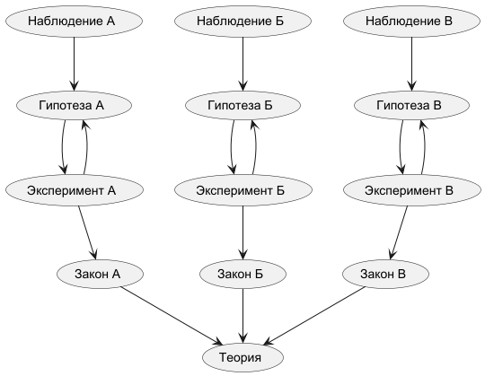

.. _rst_physics7_intro_intro:

Введение
========

Основные понятия
----------------

.. note::
    На основе курса `7 класс (основная школа), Павел ВИКТОР`_

    Уроки:

    - Урок 1 (осн). Физика - наука о природе

**Физика**

Основоположником науки "Физика" можно считать Аристотеля, автора
фундаментального трактата "Физика".

"...название происходит от греческого слова physis, что значит "природа"."

-- Божинова Ф.Я., Физика. 7 класс: Учебник - Х.:Издательство "Ранок", 2007. стр.3

.. important::
    **Физика** - наука о явлениях неживой природы

Наука **"Физика"** занимается изучением явлений неживой природы.

**Материя**

Понятие **"Материя"** включает в себя:

- Вещество
- Поле

"Все, что нас окружает, ученные называют **материей**.
Услышав слово "материя", многие из вас представляют себе какую-то ткань - например джинсовую.
Но для физиков это понятие намного шире.
Ту материю, которую можно воспринять с помощью наших органов чувств (например, пощупать), называют **веществом**.
Вещество - это и металлы, и пластики, и дерево, и воздух...

Определенная часть пространства, занятая веществом, называется **физическим телом**."

-- Божинова Ф.Я., Физика. 7 класс: Учебник - Х.:Издательство "Ранок", 2007. стр.7

"В ХIХ столетии ученые установили, что кроме вещества существует еще один вид материи,
который невозможно "пощупать". Этот особый вид материи называется **полем**."

-- Божинова Ф.Я., Физика. 7 класс: Учебник - Х.:Издательство "Ранок", 2007. стр.8

**Явления**

В физике различают два вида явлений:

- Явления неживой природы (изменения)
- Физические явления

"Изменения в окружающем нас мире, то есть в природе, ученые называют специальным термином - **явления**.
Восход и закат Солнца, сход снежной лавины, извержение вулкана, бег лошади,
прыжок пантеры - все это примеры **природных явлений**.
Чтобы лучше понять сложные природные явления, ученые разделяют их
на совокупность **физических явлений** - явлений, которые можно описать с помощью физических законов."

-- Божинова Ф.Я., Физика. 7 класс: Учебник - Х.:Издательство "Ранок", 2007. стр.8-9

Пример:
    Молния - явление неживой природы.

Физические явления:

- **Оптика** - видим молнию (световое физическое явления)
- **Акустика** - слышим гром (звуковое физическое явление)
- **Термодинамика** - в молнии высокая температура (тепловое физическое явление)
- **Электродинамика** - электроника может выйти из строя (электромагнитное физическое явление)
- **Механика** - движение грозовой тучи (механическое физическое явление)

Дополнительные разделы физики:

- **Атомная физика**
- **Ядерная физика**
- **Физика элементарных частиц**

Научные методы изучения природы
-------------------------------

"Основной задачей ученых-физиков является проведение физических исследований.
**Физическое исследование** - это целенаправленное изучение того или иного явления средствами физики."

-- Божинова Ф.Я., Физика. 7 класс: Учебник - Х.:Издательство "Ранок", 2007. стр.12

   Научный метод изучения природы

**Наблюдение** - исследование явления без создания специальных условий.

"Наблюдение - это восприятие природы с целью получения первичных данных для дальнейшего анализа."

-- Божинова Ф.Я., Физика. 7 класс: Учебник - Х.:Издательство "Ранок", 2007. стр.12

Пример наблюдения:
    Тяжелые тела (блокнот) падают быстрее легких (лист бумаги).

**Гипотеза** - предположение, сделанное на основе наблюдения.

Пример гипотезы:
    Любое тяжелое тело падает быстрее легкого.

**Эксперимент** - это исследование явления в специально созданных условиях.

"Эксперимент - это исследование физического явления в условиях,
находящихся под контролем ученого, с целью более глубокого изучения этого явления."

-- Божинова Ф.Я., Физика. 7 класс: Учебник - Х.:Издательство "Ранок", 2007. стр.12

Пример эксперимента:
    Бросаем комок бумаги и несвернутый лист бумаги.
    Комок бумаги падает быстрее несвернутого листа.

Гипотеза:
    Что-то влияет на скорость падения бумаги (воздух?)

Эксперимент:
    Изучим падение уменьшив или исключив влияние воздуха.

**Закон** свободного падения:
    Все тела падают под действием силы тяжести одинаково.

На основании законов строится **Теория**.

Ссылки
------

#. `7 класс (основная школа), Павел ВИКТОР`_
#. Кирик Л.А., Физика-7. Разноуровневые самостоятельные и контрольные работы. Харьков: "Гимназия", 2002. - 112 с.
#. Лукашик В.И., Сборник задач по физике. 7-9 классы - 25-е изд. - М.: Просвещение, 2011. - 240 с.
#. Божинова Ф.Я., Физика. 7 класс: Учебник - Х.:Издательство "Ранок", 2007. - 192 с.
#. Перышкин А.В., Физика. 7 кл. - 14-е изд. - М.: Дрофа, 2010. - 192 с.

.. _7 класс (основная школа), Павел ВИКТОР: https://www.youtube.com/watch?v=2JGbRnJfG0g&list=PL1Us50cZo25nsoM_r05Jcx5VX5uKF1seU
